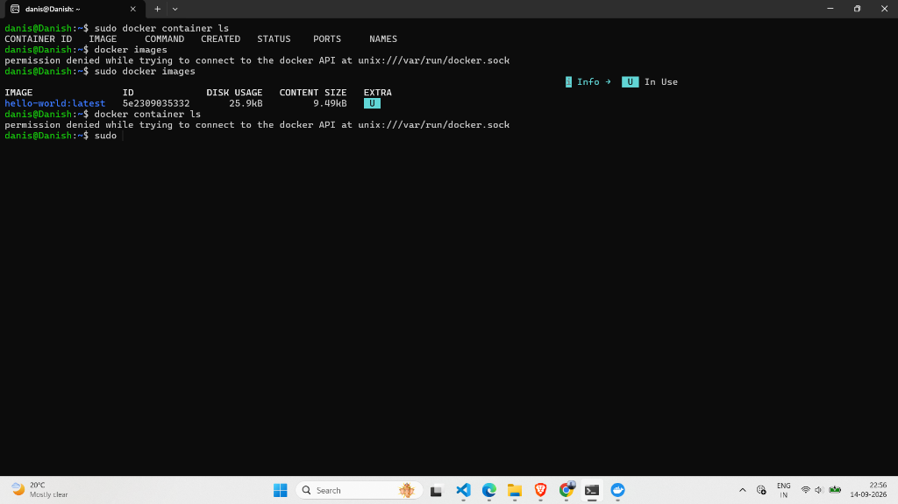
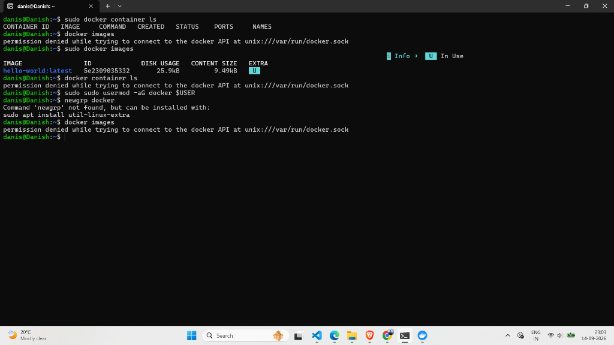

# Lab 48: Install Docker on Windows (WSL 2)

## 📌 Objective

Install Docker Desktop on Windows with the WSL 2 backend and verify that the Docker CLI is accessible from within a WSL terminal.

---

## 🧰 Prerequisites

| Requirement | Details |
|-------------|---------|
| OS | Windows 10/11 64-bit |
| BIOS | Hardware virtualization (VT-x / AMD-V) enabled |
| WSL 2 | Windows Subsystem for Linux v2 installed |

---

## 🔧 Step 1 — Install WSL 2

Open **PowerShell as Administrator** and run:

```powershell
wsl --install
```

Verify WSL is running version 2:

```bash
wsl --status
wsl -l -v
```

---

## 🐳 Step 2 — Install Docker Desktop

1. Download Docker Desktop from: [https://www.docker.com/products/docker-desktop/](https://www.docker.com/products/docker-desktop/)
2. Run the installer.
3. During setup, ensure **"Use WSL 2 based engine"** is checked.
4. Restart your PC if prompted.

---

## ⚙️ Step 3 — Enable WSL Integration

1. Open **Docker Desktop**.
2. Go to **Settings (⚙️)** → **Resources** → **WSL Integration**.
3. Toggle **ON** for your distro (e.g., Ubuntu).
4. Click **Apply & restart**.

> Without this step, running `docker` inside your WSL terminal will show:
> ```
> The command 'docker' could not be found in this WSL 2 distro.
> ```

---

## ✅ Step 4 — Verify Installation

```bash
docker --version
docker run hello-world
```

Expected: Docker prints the "Hello from Docker!" message confirming everything works.

---

## 🛠️ Troubleshooting

### Problem: Permission Denied on `docker.sock`

Running `docker images` without `sudo`:

```
permission denied while trying to connect to the docker API at unix:///var/run/docker.sock
```



**Root Cause:** Your Linux user is not in the `docker` group, so it can't access the Docker daemon socket.

### Fix: Add User to the Docker Group

```bash
sudo usermod -aG docker $USER
```

Then **restart your WSL terminal** (close and reopen) for the group change to take effect.



> **Note:** If `newgrp docker` shows "command not found", install it with:
> ```bash
> sudo apt install util-linux-extra
> newgrp docker
> ```

---

## 📝 Key Takeaways

- Docker Desktop runs on Windows but exposes its engine to WSL 2 distros via integration settings.
- Always ensure **WSL Integration** is enabled in Docker Desktop settings for your distro.
- The `docker` group grants non-root users access to the Docker daemon — without it, every command needs `sudo`.
- After running `usermod`, you must **restart your terminal session** for the changes to apply.

