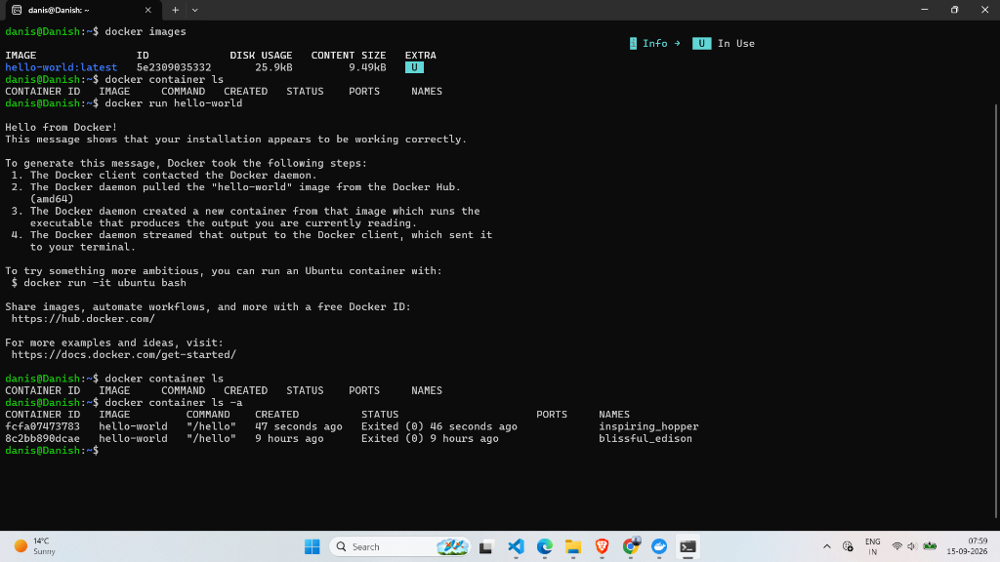

# Lab 49: Hello World Container — Initial Inspection

## 📌 Objective

Learn how to inspect locally available Docker images and check for running containers before launching anything.

---

## 🔍 Commands Covered

### 1. List All Local Images

```bash
docker images
```

**Alternative syntax:**

```bash
docker image ls
```

**Output observed:**

```
IMAGE              ID             DISK USAGE   CONTENT SIZE   EXTRA
hello-world:latest 5e2309035332   25.9kB       9.49kB         U
```

The `hello-world` image was already downloaded from a previous test run. It is extremely small (~25.9 KB) — it exists only to verify Docker works.

---

### 2. List Running Containers

```bash
docker container ls
```

**Output observed:**

```
CONTAINER ID   IMAGE   COMMAND   CREATED   STATUS   PORTS   NAMES
```

Empty! No containers are currently running. This is expected because we haven't started any yet.

---

### 3. List ALL Containers (Including Stopped)

```bash
docker container ls -a
```

The `-a` flag shows **all** containers — including ones that finished and exited.

**Output observed:**

```
CONTAINER ID   IMAGE         COMMAND    CREATED            STATUS                        NAMES
fcfa07473783   hello-world   "/hello"   47 seconds ago     Exited (0) 46 seconds ago     inspiring_hopper
8c2bb890dcae   hello-world   "/hello"   9 hours ago        Exited (0) 9 hours ago        blissful_edison
```

---

## 📸 Screenshot



---

## 📝 Key Takeaways

| Concept | Explanation |
|---------|-------------|
| `docker images` | Shows images downloaded to your local machine |
| `docker container ls` | Shows only **running** containers |
| `docker container ls -a` | Shows **all** containers (running + stopped) |
| Exit Code `0` | Means the container ran successfully and exited normally |
| Random names | Docker auto-assigns fun names like `inspiring_hopper` and `blissful_edison` if you don't specify `--name` |

