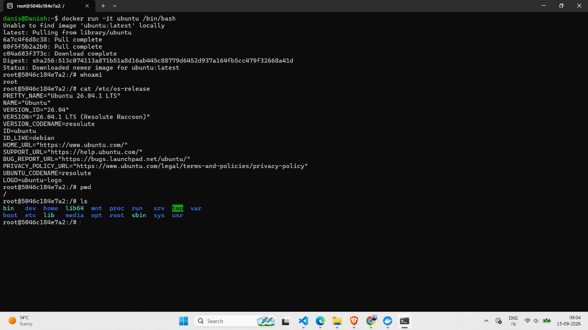
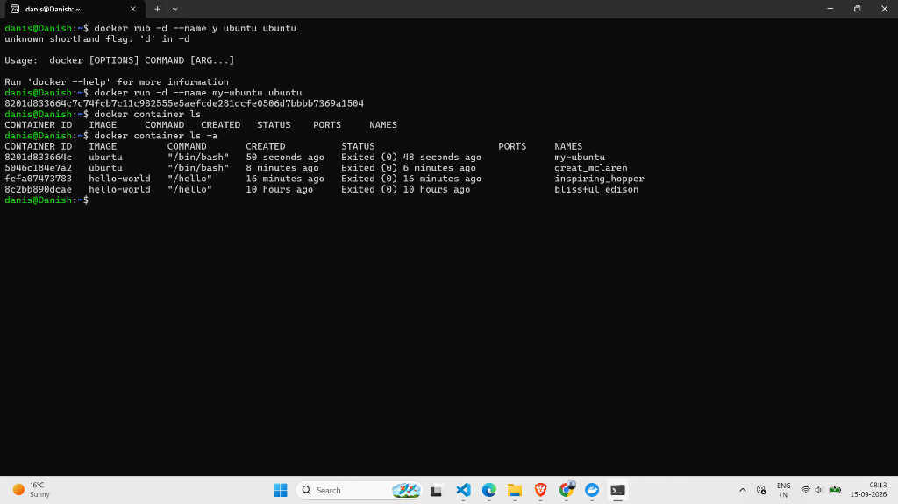
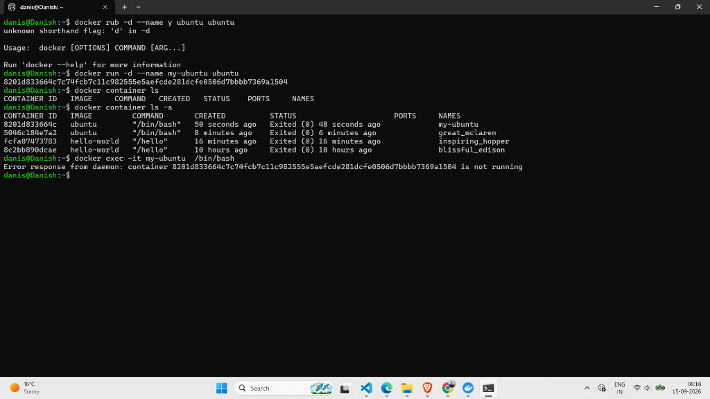
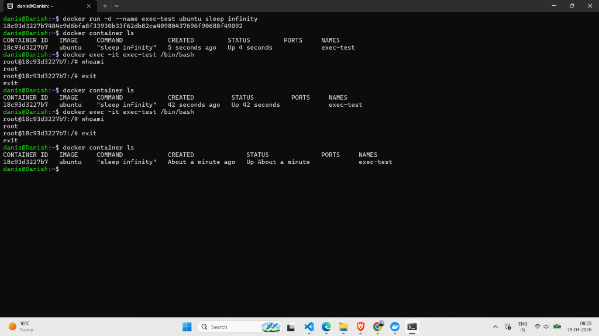

# Lab 51: Run Ubuntu Interactive Container

## 📌 Objective

Launch an Ubuntu container in interactive mode, explore the Linux filesystem inside it, and learn the difference between interactive (`-it`) and detached (`-d`) modes.

---

## Part 1 — Interactive Mode (`-it`)

### Command

```bash
docker run -it ubuntu /bin/bash
```

### Flag Breakdown

| Flag | Full Form | Purpose |
|------|-----------|---------|
| `-i` | `--interactive` | Keeps STDIN open so you can type commands |
| `-t` | `--tty` | Allocates a pseudo-terminal (gives you a proper shell prompt) |

### What Happened

1. Docker could not find `ubuntu:latest` locally.
2. Pulled it from Docker Hub (`library/ubuntu`).
3. Dropped into a root shell inside the container:

```
root@5046c184e7a2:/#
```

### Commands Executed Inside the Container

```bash
whoami
# Output: root

cat /etc/os-release
# Output: Ubuntu 26.04.1 LTS (Resolute Raccoon)

pwd
# Output: /

ls
# Output: bin boot dev etc home lib lib64 media mnt opt proc root run sbin srv sys tmp usr var
```

> The container has its own **isolated filesystem** — completely separate from your Windows/WSL host.

### Exiting the Container

```bash
exit
```

> When you type `exit` in interactive mode, the container **stops** because the shell process (`/bin/bash`) was the only running process.

### 📸 Screenshot



---

## Part 2 — Detached Mode (`-d`)

### ❌ Attempt 1: Plain detached mode (fails)

```bash
docker run -d --name my-ubuntu ubuntu
```

**Result:** Container starts and immediately **exits**.

```bash
docker container ls        # Empty — container is not running!
docker container ls -a     # Shows "my-ubuntu" with status: Exited (0)
```

**Why?** The Ubuntu image's default command is `/bin/bash`. A bash shell with no interactive input and no foreground task exits immediately.

### 📸 Screenshot



---

### ❌ Attempt 2: `docker exec` on a stopped container

```bash
docker exec -it my-ubuntu /bin/bash
```

**Error:**

```
Error response from daemon: container 8201d833664c... is not running
```

> You cannot `exec` into a container that has already stopped. The container must be in a **running** state.

### 📸 Screenshot



---

### ✅ Attempt 3: Keep container alive with `sleep infinity`

```bash
docker run -d --name exec-test ubuntu sleep infinity
```

**Why this works:** `sleep infinity` is a process that runs forever, keeping the container alive in the background.

```bash
docker container ls
```

**Output:**

```
CONTAINER ID   IMAGE    COMMAND            CREATED          STATUS         NAMES
18c93d3227b7   ubuntu   "sleep infinity"   5 seconds ago    Up 4 seconds   exec-test
```

✅ Container is **running**!

---

### ✅ Now `docker exec` works

```bash
docker exec -it exec-test /bin/bash
```

Successfully entered the running container:

```bash
whoami
# Output: root
exit
```

After exiting `exec`, the container **keeps running** because `sleep infinity` is still active.

```bash
docker container ls
# exec-test is still Up!
```

### 📸 Screenshot



---

## 🧠 Interactive vs Detached — Comparison

| Feature | Interactive (`-it`) | Detached (`-d`) |
|---------|-------------------|-----------------|
| Terminal access | Immediate shell | No direct terminal |
| Runs in | Foreground | Background |
| Container stops when | You type `exit` | The main process ends |
| Use case | Exploring, debugging | Running services (web servers, databases) |
| Access later with | N/A (you're already in) | `docker exec -it <name> /bin/bash` |

---

## 📝 Key Takeaways

1. **`-it` gives you a live terminal** inside the container — great for learning and debugging.
2. **`-d` runs the container in the background** — but it needs a long-running process to stay alive.
3. **Plain `docker run -d ubuntu`** exits immediately because `/bin/bash` has nothing to do without `-it`.
4. **`sleep infinity`** is a simple trick to keep a container running for practice.
5. **`docker exec`** lets you enter a **running** container without stopping it — unlike `docker run` which creates a new one.
6. Exiting from `exec` does **not** stop the container (the main process `sleep infinity` keeps going).

