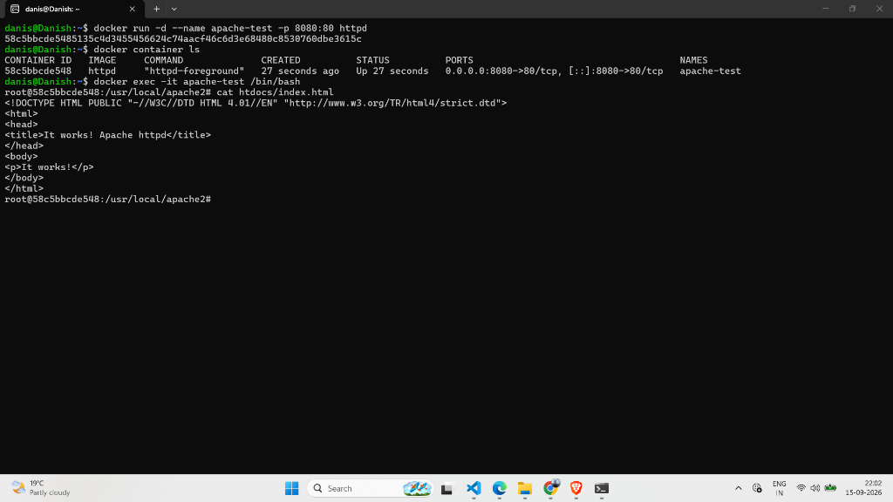
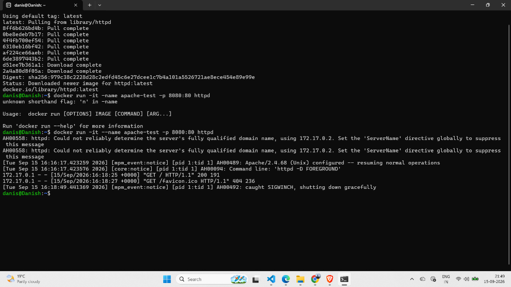

# Lab 52: Run Apache (httpd) Interactive Container

## 📌 Objective

Run an Apache web server inside a Docker container, access the default webpage from the browser using port mapping (`-p`), and explore the container's filesystem using `docker exec`.

---

## 🧠 Concepts Used

| Concept | Flag | Purpose |
|---------|------|---------|
| **Port Mapping** | `-p 8080:80` | Opens a door — maps host port 8080 → container port 80 |
| **Interactive Mode** | `-it` | See Apache logs live in your terminal |
| **Detached Mode** | `-d` | Run Apache silently in the background |
| **Exec** | `docker exec` | Enter the running container without creating a new one |

---

## 🔧 Part 1 — Pull the Apache Image

```bash
docker pull httpd
```

Verify it's downloaded:

```bash
docker images
```

> The official Apache image on Docker Hub is called **`httpd`**, not `apache`.

---

## ▶️ Part 2 — Run Apache in Interactive Mode

```bash
docker run -it --name apache-test -p 8080:80 httpd
```

### Output Observed

```
AH00558: httpd: Could not reliably determine the server's fully qualified domain name, using 172.17.0.2.
AH00489: Apache/2.4.68 (Unix) configured -- resuming normal operations
Command line: 'httpd -D FOREGROUND'
```

| Message | Meaning |
|---------|---------|
| `AH00558` | ⚠️ Warning only — Apache doesn't know its hostname. Normal in containers. |
| `resuming normal operations` | ✅ Apache is UP and running |
| `httpd -D FOREGROUND` | ✅ Apache is running in foreground (because of `-it`) |

### Browser Test

Opened **http://localhost:8080** in the browser → Saw **"It works!"** ✅

### 📸 Screenshot — Interactive Mode



### Stopping

Pressed `Ctrl + C` in the terminal → Apache stopped → Container exited.

---

## 🔄 Part 3 — Run Apache in Detached Mode

First, removed the old container:

```bash
docker rm apache-test
```

Then ran in background:

```bash
docker run -d --name apache-test -p 8080:80 httpd
```

Verified it's running:

```bash
docker container ls
```

```
CONTAINER ID   IMAGE   COMMAND              STATUS         PORTS                  NAMES
64886dcb79f9   httpd   "httpd-foreground"   Up 2 minutes   0.0.0.0:8080->80/tcp   apache-test
```

Opened **http://localhost:8080** → **"It works!"** ✅ (terminal stays free this time)

### 📸 Screenshot — Detached Mode, Exec & index.html



---

## 🔍 Part 4 — Explore Inside the Container

```bash
docker exec -it apache-test /bin/bash
```

### Commands Executed Inside

```bash
# Check the default webpage
cat htdocs/index.html
# Output: <html><body><h1>It works!</h1></body></html>

# Check Apache version
httpd -v
# Output: Apache/2.4.68 (Unix)

# Check who you are
whoami
# Output: root

# Exit (container keeps running!)
exit
```

---

## 🛠️ Useful Commands Learned

| Command | What It Does |
|---------|-------------|
| `docker start <name>` | Restarts a stopped container |
| `docker rm -f <name>` | Force stops AND removes a container in one command |
| `docker logs <name>` | View logs of a detached container |
| `docker logs -f <name>` | Follow logs in real-time (like `tail -f`) |

---

## 🧹 Cleanup

```bash
docker stop apache-test
docker rm apache-test
```

---

## 📝 Key Takeaways

1. **`httpd`** is the official Apache image on Docker Hub.
2. **`-p 8080:80`** maps your machine's port to the container's port — without it, the browser can't reach Apache.
3. **Interactive mode (`-it`)** shows live logs — useful for debugging. Container stops on `Ctrl+C`.
4. **Detached mode (`-d`)** runs silently in background — use `docker logs` to see output.
5. **`docker exec`** lets you enter a running container. Exiting `exec` does NOT stop the container.
6. **`docker rm -f`** is a shortcut to force-stop and remove a container in one command.
7. The default Apache page is located at **`/usr/local/apache2/htdocs/index.html`** inside the container.

