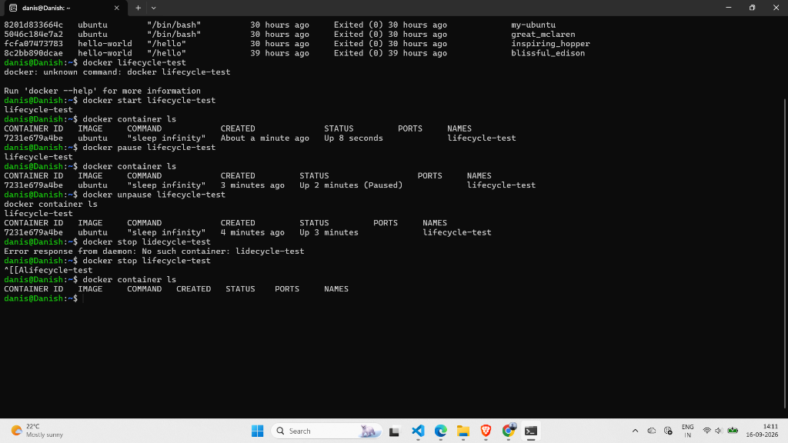
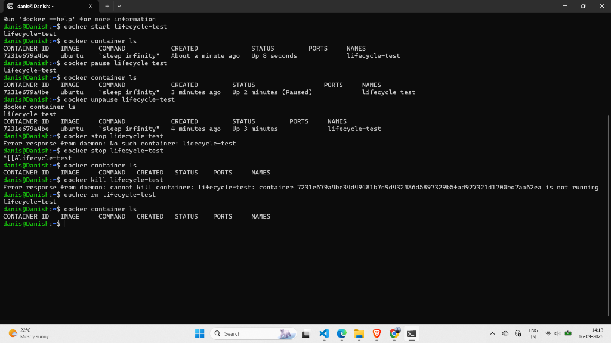

# Lab 53: Docker Container Lifecycle

## 📌 Objective

Understand the full lifecycle of a Docker container — from creation to deletion — by running each lifecycle command step by step.

---

## 🧠 Lifecycle Diagram

```
          docker create
               │
               ▼
         ┌──────────┐
         │  CREATED  │  Container exists but is NOT running
         └─────┬────┘
               │ docker start
               ▼
         ┌──────────┐         docker pause
         │  RUNNING  │ ─────────────────► ┌──────────┐
         └─────┬────┘                     │  PAUSED  │
               │              ◄────────── └──────────┘
               │            docker unpause
               │
     docker stop │ docker kill
               │
               ▼
         ┌──────────┐
         │  STOPPED  │  Container is dead but still exists on disk
         └─────┬────┘
               │ docker rm
               ▼
         ┌──────────┐
         │  DELETED  │  Gone forever
         └──────────┘
```

---

## ▶️ Step-by-Step Execution

### 1. Create (without starting)

```bash
docker create --name lifecycle-test ubuntu sleep infinity
```

- Container is **created** but NOT running.
- `docker container ls` → empty (it's not running)
- `docker container ls -a` → shows status: **"Created"**

> **`docker create` vs `docker run`:**
> - `create` = creates the container but does NOT start it
> - `run` = creates AND starts the container

---

### 2. Start

```bash
docker start lifecycle-test
docker container ls
```

```
CONTAINER ID   IMAGE    COMMAND            CREATED              STATUS         NAMES
7231e679a4be   ubuntu   "sleep infinity"   About a minute ago   Up 8 seconds   lifecycle-test
```

Status changed from "Created" → **"Up 8 seconds"** ✅

---

### 3. Pause

```bash
docker pause lifecycle-test
docker container ls
```

```
CONTAINER ID   IMAGE    COMMAND            CREATED         STATUS                  NAMES
7231e679a4be   ubuntu   "sleep infinity"   3 minutes ago   Up 2 minutes (Paused)   lifecycle-test
```

Status: **"Up 2 minutes (Paused)"** — the container is frozen. All processes inside are suspended.

---

### 4. Unpause

```bash
docker unpause lifecycle-test
docker container ls
```

```
CONTAINER ID   IMAGE    COMMAND            CREATED         STATUS         NAMES
7231e679a4be   ubuntu   "sleep infinity"   4 minutes ago   Up 3 minutes   lifecycle-test
```

Status: Back to **"Up 3 minutes"** — container is running again ✅

---

### 5. Stop (Graceful)

```bash
docker stop lifecycle-test
docker container ls
```

```
CONTAINER ID   IMAGE   COMMAND   CREATED   STATUS   PORTS   NAMES
```

Empty! Container has stopped. Check with `-a`:

```bash
docker container ls -a
```

Status: **"Exited (0)"** — stopped successfully.

---

### 6. Restart from Stopped State

```bash
docker start lifecycle-test
docker container ls
```

Container goes from Exited → **"Up"** again! You can restart stopped containers.

---

### 7. Kill (Force Stop)

```bash
docker kill lifecycle-test
```

- **`stop`** = polite (sends SIGTERM, waits 10 sec, then SIGKILL)
- **`kill`** = instant (sends SIGKILL immediately)

> ⚠️ **Note:** You cannot `kill` a container that is already stopped. You'll get:
> ```
> Error: cannot kill container: container is not running
> ```

---

### 8. Remove (Delete Permanently)

```bash
docker rm lifecycle-test
docker container ls -a
```

Container is gone forever. No trace left.

---

## 📸 Screenshots

### Create → Start → Pause → Stop



### Kill → Remove → Delete



---

## 🧾 Commands Used in This Lab

| # | Command | Lifecycle Transition | Description |
|---|---------|---------------------|-------------|
| 1 | `docker create --name lifecycle-test ubuntu sleep infinity` | → Created | Create container without starting |
| 2 | `docker start lifecycle-test` | Created → Running | Start a created/stopped container |
| 3 | `docker pause lifecycle-test` | Running → Paused | Freeze all processes inside |
| 4 | `docker unpause lifecycle-test` | Paused → Running | Resume frozen processes |
| 5 | `docker stop lifecycle-test` | Running → Stopped | Graceful shutdown (SIGTERM → SIGKILL) |
| 6 | `docker kill lifecycle-test` | Running → Stopped | Instant force kill (SIGKILL only) |
| 7 | `docker rm lifecycle-test` | Stopped → Deleted | Permanently delete the container |

---

## 📝 Key Takeaways

1. **`docker create`** creates a container without starting it — useful when you want to configure it first.
2. **`docker start`** can restart a stopped container — you don't always need `docker run`.
3. **`docker pause`** freezes all processes — the container stays in memory but does nothing.
4. **`docker stop`** is graceful (10 sec timeout). **`docker kill`** is instant.
5. **`docker kill` only works on running containers** — you can't kill something that's already stopped.
6. **`docker rm`** deletes a stopped container permanently. Use `docker rm -f` to force-stop and delete in one command.
7. The full lifecycle: **Create → Start → (Pause/Unpause) → Stop → (Start again) → Kill → Remove**
