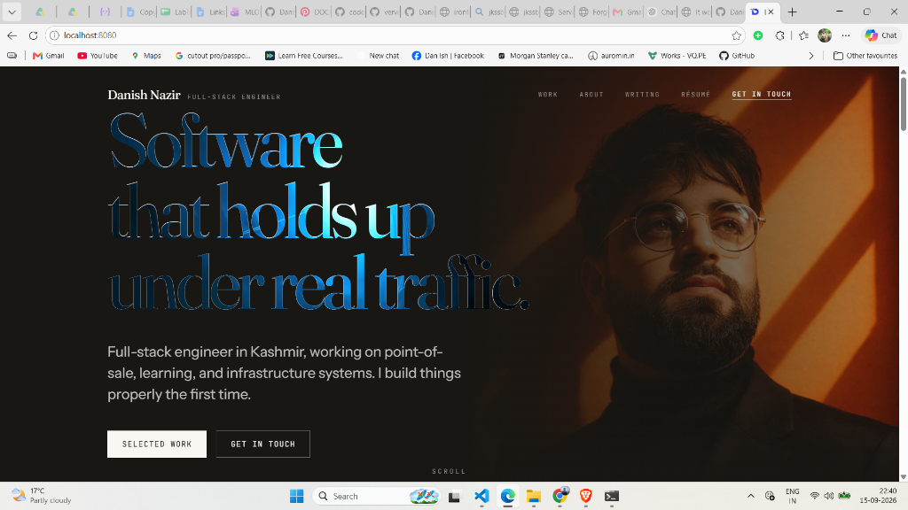
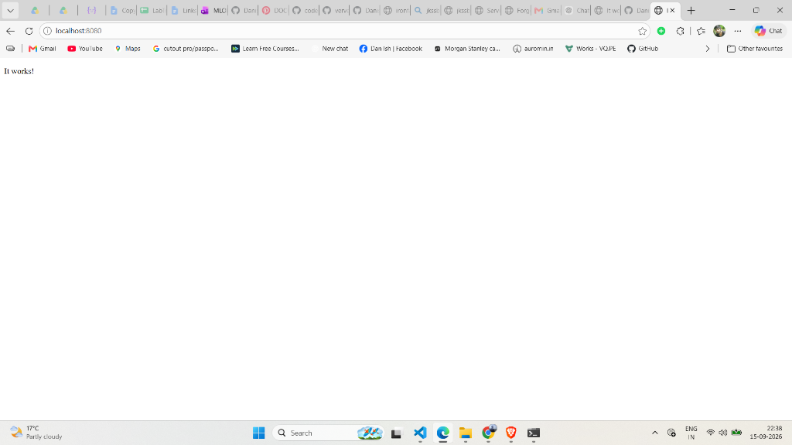

# Lab 53: Volume Mount — Serve Portfolio Website with Docker

## 📌 Objective

Use Docker volume mounting (`-v`) to serve your own portfolio website through an Apache container, instead of the default "It works!" page.

---

## 🧠 Concept — What is Volume Mount (`-v`)?

A volume mount creates a **window** between your PC and the container. The container can **directly see** files from your machine — no copying needed.

```
Your PC                                      Container
┌──────────────────────────┐                ┌──────────────────────────┐
│  Desktop/Devops/         │    -v          │  /usr/local/apache2/     │
│  my_portfolio_final/     │ ══(window)═══► │  htdocs/                 │
│  dist/                   │                │                          │
│   ├── index.html         │                │   ├── index.html         │
│   ├── resume.html        │                │   ├── resume.html        │
│   └── assets/            │                │   └── assets/            │
└──────────────────────────┘                └──────────────────────────┘
```

- Files are **NOT copied** — the container reads them directly.
- If you edit a file on your PC, the container sees the change **instantly**.

---

## 🔧 Step 1 — Remove Old Containers

```bash
docker rm -f apache-test
docker rm -f my-portfolio
```

---

## ▶️ Step 2 — Run Apache with Volume Mount

```bash
docker run -d --name my-portfolio -p 8080:80 -v /mnt/c/Users/danis/Desktop/Devops/my_portfolio_final/dist:/usr/local/apache2/htdocs/ httpd
```

### Command Breakdown

| Part | What It Does |
|------|-------------|
| `-d` | Run in background (detached mode) |
| `--name my-portfolio` | Name the container `my-portfolio` |
| `-p 8080:80` | 🚪 DOOR — Maps host port 8080 → container port 80 |
| `-v /mnt/c/.../dist:/usr/local/apache2/htdocs/` | 🪟 WINDOW — Mounts portfolio files into Apache's web root |
| `httpd` | Apache image |

> **Note:** In WSL, Windows path `C:\Users\...` becomes `/mnt/c/Users/...`

---

## ✅ Step 3 — Verify Container is Running

```bash
docker container ls
```

```
CONTAINER ID   IMAGE   COMMAND              STATUS       PORTS                  NAMES
12914dceee51   httpd   "httpd-foreground"   Up 1 min     0.0.0.0:8080->80/tcp   my-portfolio
```

---

## 🔍 Step 4 — Verify Files Inside the Container

```bash
docker exec -it my-portfolio /bin/bash
ls -la /usr/local/apache2/htdocs/
```

**Output:**

```
-rwxrwxrwx 1 1000 1000  9856 Aug 18 14:46 apple-touch-icon.png
drwxrwxrwx 1 1000 1000  4096 Aug 22 05:20 assets
-rwxrwxrwx 1 1000 1000  1628 Aug 18 14:46 favicon-32.png
drwxrwxrwx 1 1000 1000  4096 Aug 22 05:20 gallery
drwxrwxrwx 1 1000 1000  4096 Aug 22 05:20 images
-rwxrwxrwx 1 1000 1000  2636 Aug 22 05:20 index.html
-rwxrwxrwx 1 1000 1000 14908 Aug 22 05:19 resume.html
-rwxrwxrwx 1 1000 1000   168 Aug 22 05:19 robots.txt
-rwxrwxrwx 1 1000 1000  2310 Aug 22 05:19 sitemap.xml
drwxrwxrwx 1 1000 1000  4096 Aug 22 05:20 video
drwxrwxrwx 1 1000 1000  4096 Aug 22 05:20 work
```

✅ All portfolio files are visible inside the container!

---

## 🌐 Step 5 — Open in Browser

Opened **http://localhost:8080** → Portfolio website is LIVE! 🎉

### 📸 Screenshot — Portfolio Running in Docker



---

## 🛠️ Troubleshooting

### Problem: Port Already Allocated

```
Error: Bind for 0.0.0.0:8080 failed: port is already allocated
```

**Cause:** Another container is already using port 8080.

**Fix:** Remove the old container first:

```bash
docker rm -f <old-container-name>
```

Then run your new container again.

### Problem: Browser Shows Cached "It Works!" Page

**Fix:** Hard refresh with `Ctrl + Shift + R` to clear browser cache.

### 📸 Screenshot — Cached Page Before Fix



---

## 🧾 Commands Used in This Lab

| # | Command | Description |
|---|---------|-------------|
| 1 | `docker rm -f <name>` | Force remove old containers to free the port |
| 2 | `docker run -d --name my-portfolio -p 8080:80 -v <host-path>:<container-path> httpd` | Run Apache with port mapping + volume mount |
| 3 | `docker container ls` | Verify the container is running |
| 4 | `docker exec -it my-portfolio /bin/bash` | Enter the container to inspect files |
| 5 | `ls -la /usr/local/apache2/htdocs/` | List mounted files inside the container |

---

## 📝 Key Takeaways

1. **`-v` (volume mount)** lets the container see files from your PC — no copying needed.
2. **Format:** `-v <host-path>:<container-path>` — left side is your machine, right side is inside the container.
3. **WSL path conversion:** Windows `C:\Users\...` becomes `/mnt/c/Users/...` in WSL.
4. **Changes are instant** — edit a file on your PC, refresh the browser, container serves the updated file.
5. **Port conflicts** — only one container can use a port at a time. Use `docker rm -f` to free it.
6. **`-p` (port) = DOOR** for network access, **`-v` (volume) = WINDOW** for file access.
