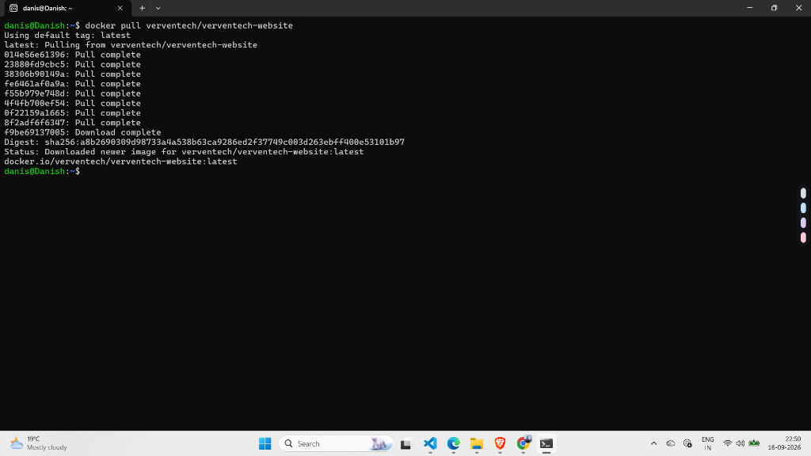
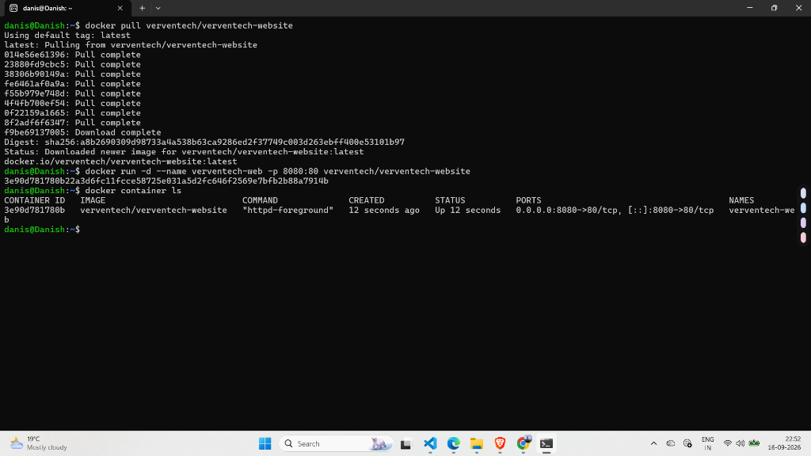
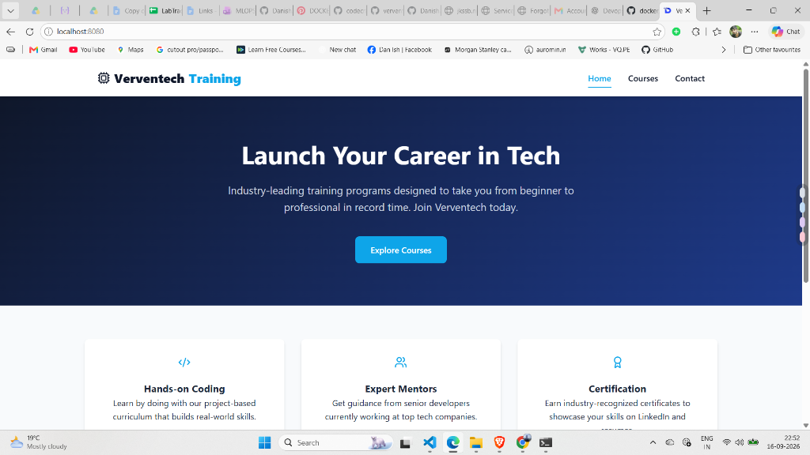

# Lab 55: Run VerveTech Website Container with Port Forwarding

## 📌 Objective

Pull the VerveTech Training website image from Docker Hub and run it as a container with port forwarding to access it from the browser.

---

## 🧠 What We're Doing

```
Docker Hub                         Your Machine                    Browser
┌──────────────────┐              ┌──────────────┐              ┌──────────────┐
│ verventech/       │  docker pull │  Container   │  -p 8080:80 │              │
│ verventech-website│ ──────────► │  (Apache +   │ ◄─────────► │ localhost    │
│                  │              │   Website)   │              │ :8080        │
└──────────────────┘              └──────────────┘              └──────────────┘
```

1. **Pull** the image from Docker Hub (downloads the website + Apache bundled together)
2. **Run** it with `-p 8080:80` (port forwarding)
3. **Access** it in the browser at `localhost:8080`

---

## 🔧 Step 1 — Pull the VerveTech Image

```bash
docker pull verventech/verventech-website
```

**Output:**

```
Using default tag: latest
latest: Pulling from verventech/verventech-website
01a56e61396: Pull complete
23880fd9cbc5: Pull complete
38306b90149a: Pull complete
...
Status: Downloaded newer image for verventech/verventech-website:latest
docker.io/verventech/verventech-website:latest
```

### 📸 Screenshot — Pulling Image



---

## ▶️ Step 2 — Run with Port Forwarding

```bash
docker run -d --name verventech-web -p 8080:80 verventech/verventech-website
```

### Command Breakdown

| Part | What It Does |
|------|-------------|
| `-d` | Run in background (detached) |
| `--name verventech-web` | Name the container |
| `-p 8080:80` | Forward host port 8080 → container port 80 |
| `verventech/verventech-website` | Image from Docker Hub |

---

## ✅ Step 3 — Verify Container is Running

```bash
docker container ls
```

```
CONTAINER ID   IMAGE                            COMMAND              STATUS        PORTS                                   NAMES
3e90d781780b   verventech/verventech-website     "httpd-foreground"   Up 12 sec     0.0.0.0:8080->80/tcp, [::]:8080->80/tcp verventech-web
```

- **PORTS column:** `0.0.0.0:8080->80/tcp` confirms port forwarding is active ✅
- **COMMAND:** `httpd-foreground` — the image uses Apache (httpd) to serve the website

### 📸 Screenshot — Container Running



---

## 🌐 Step 4 — Access in Browser

Opened: **http://localhost:8080**

VerveTech Training website is LIVE! 🎉

- **Header:** "Launch Your Career in Tech"
- **Navigation:** Home, Courses, Contact
- **Features:** Hands-on Coding, Expert Mentors, Certification

### 📸 Screenshot — Website in Browser



---

## 🧹 Cleanup

```bash
docker rm -f verventech-web
```

---

## 🧾 Commands Used in This Lab

| # | Command | Description |
|---|---------|-------------|
| 1 | `docker pull verventech/verventech-website` | Download the VerveTech website image from Docker Hub |
| 2 | `docker run -d --name verventech-web -p 8080:80 verventech/verventech-website` | Run the website container with port forwarding |
| 3 | `docker container ls` | Verify container is running and port mapping is active |
| 4 | `docker rm -f verventech-web` | Force remove the container |

---

## 📝 Key Takeaways

1. **Docker Hub** hosts pre-built images — you can pull and run any public image with one command.
2. The VerveTech image bundles **Apache + website files** into a single image — no volume mount needed.
3. **`-p 8080:80`** forwards traffic from your browser to Apache inside the container.
4. The image uses `httpd-foreground` as its command — same Apache server we used in previous labs.
5. **Image naming format:** `<organization>/<image-name>` (e.g., `verventech/verventech-website`).

