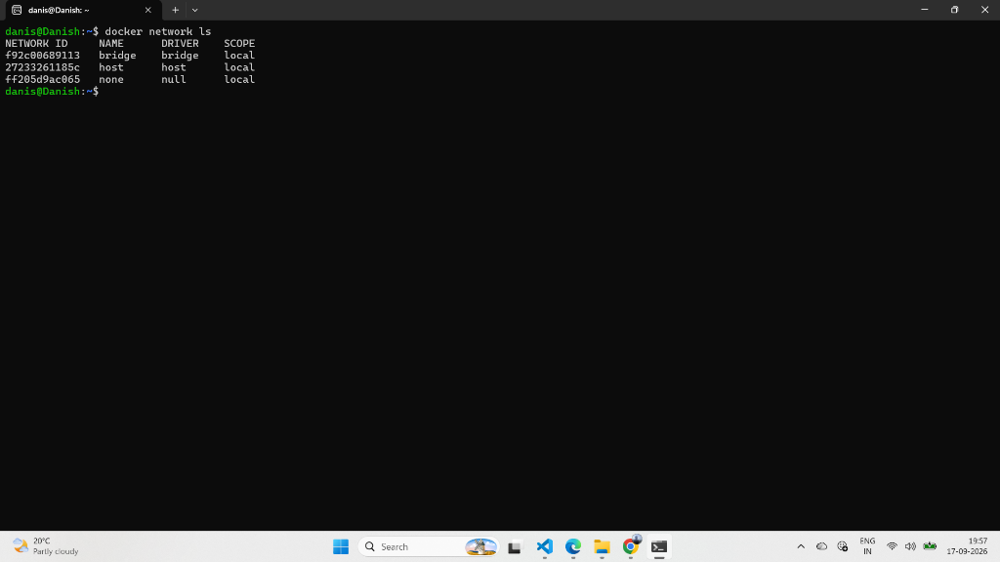
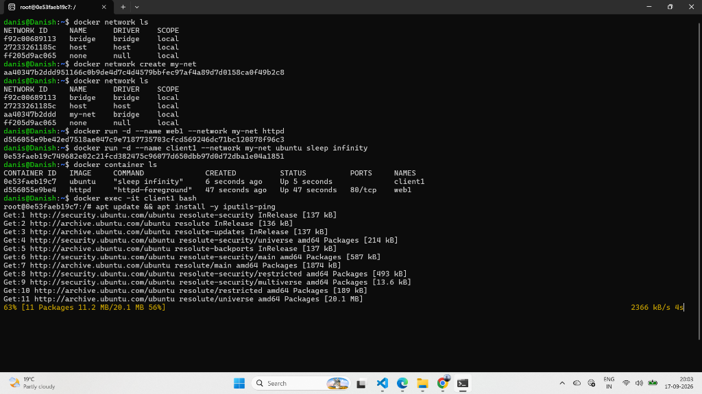

# Lab 56: Docker Networking Types with Commands

## 📌 Objective

Understand Docker networking architecture, explore the three default network drivers (`bridge`, `host`, `none`), create custom user-defined networks, and verify inter-container communication using DNS name resolution.

---

## 🧠 Docker Networking Architecture

By default, Docker isolates container networks. It provides multiple network drivers to connect containers to each other and to the external world.

```text
┌──────────────────────────────────────────────────────────────┐
│                    DOCKER HOST NETWORKING                    │
├──────────────────────────────────────────────────────────────┤
│                                                              │
│  1. BRIDGE NETWORK (Default: bridge / docker0)               │
│     ┌──────────────┐                 ┌──────────────┐        │
│     │ Container A  │◄──(Private IP)─►│ Container B  │        │
│     │ 172.17.0.2   │                 │ 172.17.0.3   │        │
│     └──────┬───────┘                 └──────────────┘        │
│            │ (Port Mapping -p)                               │
│            ▼                                                 │
│       Host Port                                              │
│                                                              │
│  2. HOST NETWORK (--network host)                            │
│     ┌──────────────────────────────────────────────┐         │
│     │ Container directly shares Host IP and Ports  │         │
│     │ (No NAT, no port forwarding needed)          │         │
│     └──────────────────────────────────────────────┘         │
│                                                              │
│  3. NONE NETWORK (--network none)                            │
│     ┌──────────────────────────────────────────────┐         │
│     │ Completely isolated (only loopback interface)│         │
│     └──────────────────────────────────────────────┘         │
│                                                              │
└──────────────────────────────────────────────────────────────┘
```

---

## 🔍 Network Types Breakdown

| Driver | Description | DNS Resolution by Name? | External Access | Best Used For |
|--------|-------------|-------------------------|-----------------|---------------|
| **bridge** (default) | Creates a private virtual network on the host | ❌ (IP only on default bridge) | Via `-p` port mapping | Single-host standalone containers |
| **custom bridge** | User-defined bridge network | ✅ (Automatic DNS by container name) | Via `-p` port mapping | Multi-container applications on same host |
| **host** | Disables network isolation; container shares host network stack | N/A (Uses host DNS) | Direct access to host ports | Maximum performance, latency-sensitive apps |
| **none** | Disables all networking interfaces except `lo` (loopback) | ❌ | ❌ No network access | Air-gapped batch jobs, security sensitive compute |

---

## ▶️ Step-by-Step Hands-on Commands

### 1. List Available Networks

Inspect existing network drivers installed by default:

```bash
docker network ls
```

**Output:**

```text
NETWORK ID     NAME      DRIVER    SCOPE
e403d15b13b7   bridge    bridge    local
8a04f44c6888   host      host      local
f2dc28ba1db6   none      null      local
```

### 📸 Screenshot — Default Network Drivers



---

### 2. Inspect the Default Bridge Network

Check subnets and connected containers:

```bash
docker network inspect bridge
```

Key fields in output:
- **Subnet:** Typically `172.17.0.0/16`
- **Gateway:** `172.17.0.1`
- **Containers:** Lists all currently connected containers and their virtual IPv4 addresses.

---

### 3. Test the Host Network Driver

Run a lightweight web server directly on the host's networking stack:

```bash
docker run -d --name test-host-net --network host httpd:alpine
```

- When using `--network host`, `-p` flags are ignored because the container binds directly to host port 80.
- Verify in browser: `http://localhost:80` (or host IP).

Clean up:
```bash
docker rm -f test-host-net
```

---

### 4. Test the None Network Driver

Run an isolated container with zero network connectivity:

```bash
docker run -it --rm --network none alpine ip addr
```

**Output:**
```text
1: lo: <LOOPBACK,UP,LOWER_UP> mtu 65536 qdisc noqueue state UNKNOWN qlen 1000
    link/loopback 00:00:00:00:00:00 brd 00:00:00:00:00:00
    inet 127.0.0.1/8 scope host lo
```
Notice: Only `lo` exists! No `eth0` is allocated.

---

### 5. Create a Custom User-Defined Bridge Network

Custom bridge networks enable **automatic DNS resolution** between containers using their container names!

```bash
docker network create my-custom-net
```

Verify creation:
```bash
docker network ls
```

---

### 6. Connect Multiple Containers to the Custom Network

Start Container 1 (Web Server):
```bash
docker run -d --name web-server --network my-custom-net httpd:alpine
```

Start Container 2 (Client / Utility):
```bash
docker run -it --rm --network my-custom-net alpine sh
```

Inside the `alpine` container shell, test DNS resolution and HTTP connectivity:

```sh
# Ping web-server by container name (automatic DNS resolution!)
ping -c 3 web-server

# Fetch webpage from web-server internally via port 80
wget -qO- http://web-server
```

**Output:**
```text
PING web-server (172.18.0.2): 56 data bytes
64 bytes from 172.18.0.2: seq=0 ttl=64 time=0.180 ms
64 bytes from 172.18.0.2: seq=1 ttl=64 time=0.145 ms
64 bytes from 172.18.0.2: seq=2 ttl=64 time=0.155 ms

<html><body><h1>It works!</h1></body></html>
```

Exit the shell:
```sh
exit
```

### 📸 Screenshot — Custom Network Creation & Inter-Container Communication



---

### 7. Clean up

```bash
docker rm -f web-server
docker network rm my-custom-net
```

---

## 🧾 Commands Reference Table

| # | Command | Purpose |
|---|---------|---------|
| 1 | `docker network ls` | List all Docker networks on host |
| 2 | `docker network inspect <network_name>` | Display detailed JSON config (subnet, gateway, connected containers) |
| 3 | `docker network create <network_name>` | Create a new user-defined bridge network |
| 4 | `docker network connect <network> <container>` | Connect an already-running container to a network |
| 5 | `docker network disconnect <network> <container>` | Disconnect a container from a network |
| 6 | `docker network rm <network_name>` | Remove a custom network |
| 7 | `docker network prune` | Remove all unused networks |

---

## 📝 Key Takeaways

1. **Default Bridge vs User-Defined Bridge**:
   - Default bridge does **not** provide container name DNS resolution (you can only ping by IP).
   - User-defined custom bridge provides **built-in DNS resolution** by container name.
2. **Host Driver**: Useful for maximum throughput where container network isolation is not required.
3. **None Driver**: Ideal for isolated computation tasks or secure batch scripts.
4. Always use custom bridge networks for production multi-container architectures.

