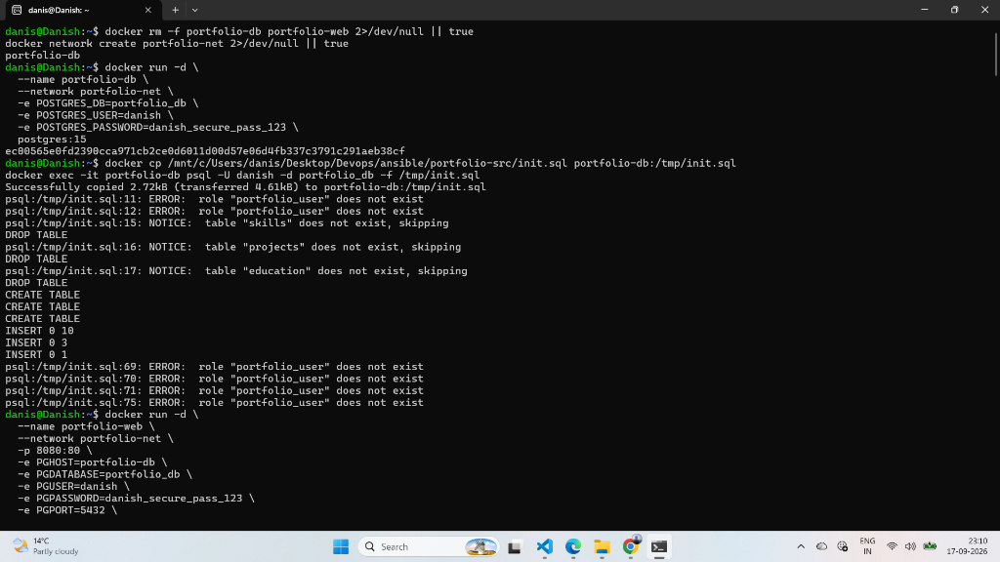
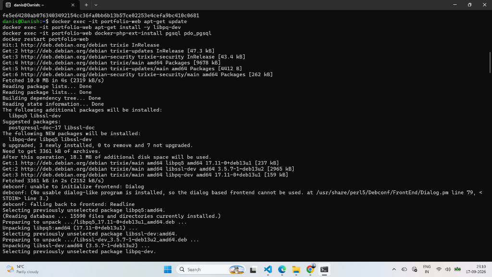
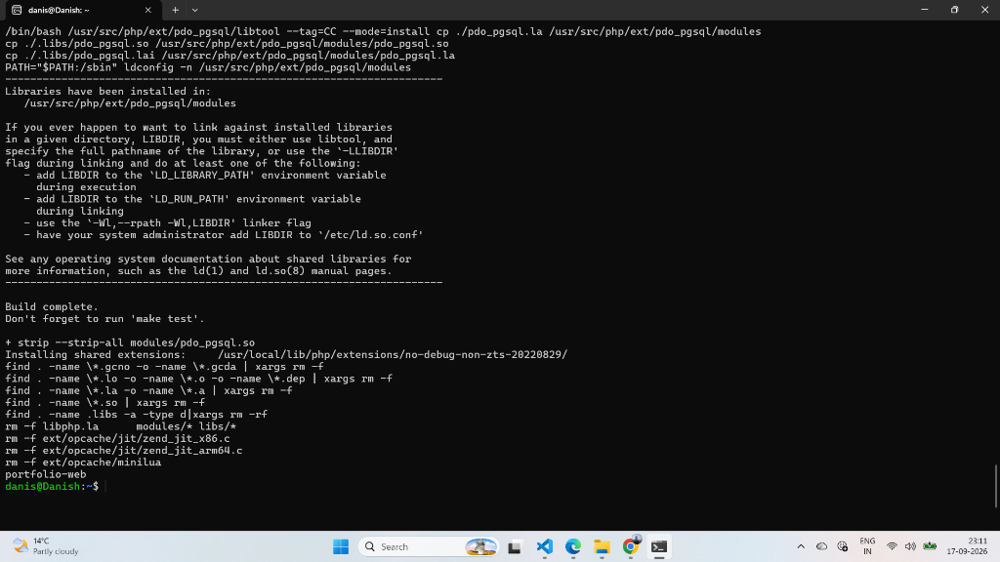

# Lab 57: Run Portfolio Project Using 2 Containers (PHP + PostgreSQL)

## 📌 Objective

Deploy a full-stack dynamic portfolio application using a multi-tier microservice architecture:
1. **Backend Database Container** (`portfolio-db`): PostgreSQL 15 database initialized with schema tables (`skills`, `projects`, `education`) via `init.sql`.
2. **Frontend Application Container** (`portfolio-web`): `php:8.2-apache` serving dynamic PHP source code with PostgreSQL client extensions (`libpq-dev`, `pdo_pgsql`, `pgsql`) and environment variables.
3. Connected over an isolated user-defined Docker bridge network (`portfolio-net`).

---

## 🏗️ Multi-Tier Architecture Diagram

```text
               Browser (Client)
                      │
                      │ http://localhost:8080
                      ▼
┌──────────────────────────────────────────────────────────────────┐
│                   Docker Host Network                            │
│                   Port Forwarding: 8080 -> 80                    │
└─────────────────────────────┬────────────────────────────────────┘
                              │
                              ▼
┌──────────────────────────────────────────────────────────────────┐
│            Custom Docker Bridge Network (portfolio-net)          │
│                                                                  │
│  ┌─────────────────────────────┐    Internal DNS    ┌──────────┐ │
│  │    Frontend Container       │   portfolio-db:5432│ Backend  │ │
│  │     (portfolio-web)         ├───────────────────►│ Container│ │
│  │      php:8.2-apache         │                    │(portfolio│ │
│  │   - PGHOST=portfolio-db     │                    │   -db)   │ │
│  │   - PGUSER=danish           │                    │PostgreSQL│ │
│  │   - PGDATABASE=portfolio_db │                    │  15      │ │
│  │   - Extensions: pdo_pgsql   │                    │          │ │
│  └──────────────┬──────────────┘                    └────┬─────┘ │
│                 │                                        │       │
│                 ▼                                        ▼       │
│      Mounted PHP Source Files                     Schema Tables  │
│     Desktop/Devops/.../portfolio-src             skills, projects│
│                                                     education    │
└──────────────────────────────────────────────────────────────────┘
```

---

## ▶️ Hands-On Execution Steps

### 1. Clean Up & Network Setup

```bash
docker rm -f portfolio-db portfolio-web 2>/dev/null || true
docker network create portfolio-net 2>/dev/null || true
```

---

### 2. Launch Container 1 — PostgreSQL 15 Database

Run the database container with explicit credentials:

```bash
docker run -d \
  --name portfolio-db \
  --network portfolio-net \
  -e POSTGRES_DB=portfolio_db \
  -e POSTGRES_USER=danish \
  -e POSTGRES_PASSWORD=danish_secure_pass_123 \
  postgres:15
```

> **Security Note:** The database container is **not** exposed to the host machine (no `-p` flag). It is isolated inside `portfolio-net`.

---

### 3. Initialize Database Schema with `init.sql`

Copy the SQL schema script into the container:

```bash
docker cp /mnt/c/Users/danis/Desktop/Devops/ansible/portfolio-src/init.sql portfolio-db:/tmp/init.sql
```

Execute the script inside PostgreSQL:

```bash
docker exec -it portfolio-db psql -U danish -d portfolio_db -f /tmp/init.sql
```

**Output Observed:**
```text
DROP TABLE
CREATE TABLE
CREATE TABLE
CREATE TABLE
INSERT 0 10
INSERT 0 3
INSERT 0 1
```

---

### 4. Launch Container 2 — PHP Apache Frontend

Launch the web container injecting the PostgreSQL connection environment variables and mounting the PHP source code:

```bash
docker run -d \
  --name portfolio-web \
  --network portfolio-net \
  -p 8080:80 \
  -e PGHOST=portfolio-db \
  -e PGDATABASE=portfolio_db \
  -e PGUSER=danish \
  -e PGPASSWORD=danish_secure_pass_123 \
  -e PGPORT=5432 \
  -v /mnt/c/Users/danis/Desktop/Devops/ansible/portfolio-src:/var/www/html/ \
  php:8.2-apache
```

### 📸 Screenshot — Database Creation, `init.sql` Execution & Frontend Launch



---

### 5. Install PostgreSQL Extensions in PHP Container

By default, official PHP images do not include PostgreSQL drivers. Install `libpq-dev` and compile the `pgsql` and `pdo_pgsql` extensions:

```bash
# Update package list and install PostgreSQL C library dependencies
docker exec -it portfolio-web apt-get update
docker exec -it portfolio-web apt-get install -y libpq-dev
```

### 📸 Screenshot — Installing libpq-dev



```bash
# Compile and enable PostgreSQL extensions for PHP
docker exec -it portfolio-web docker-php-ext-install pgsql pdo_pgsql

# Restart the Apache container to load the new modules
docker restart portfolio-web
```

### 📸 Screenshot — Installing PHP Extensions & Restarting Web Container



---

### 6. Verify in Browser

Open **http://localhost:8080** in Google Chrome / browser.

The PHP portfolio application connects directly to `portfolio-db`, queries the `skills`, `projects`, and `education` tables, and dynamically renders the portfolio live!

---

## 🧾 Commands Reference Table

| # | Command | Purpose |
|---|---------|---------|
| 1 | `docker network create portfolio-net` | Create custom network for 2-tier architecture |
| 2 | `docker run -d --name portfolio-db --network portfolio-net -e POSTGRES_DB=portfolio_db -e POSTGRES_USER=danish -e POSTGRES_PASSWORD=... postgres:15` | Run backend PostgreSQL database container |
| 3 | `docker cp init.sql portfolio-db:/tmp/init.sql` | Copy SQL schema into container |
| 4 | `docker exec -it portfolio-db psql -U danish -d portfolio_db -f /tmp/init.sql` | Execute SQL schema to create tables and seed data |
| 5 | `docker run -d --name portfolio-web --network portfolio-net -p 8080:80 -e PGHOST=portfolio-db ... php:8.2-apache` | Run frontend PHP container with DB env vars |
| 6 | `docker exec -it portfolio-web apt-get install -y libpq-dev` | Install PostgreSQL C library headers |
| 7 | `docker exec -it portfolio-web docker-php-ext-install pgsql pdo_pgsql` | Enable PHP PostgreSQL database drivers |
| 8 | `docker restart portfolio-web` | Reload Apache with the new PHP modules |

---

## 📝 Key Takeaways

1. **Full-Stack Microservices**: Decoupling the PHP web tier from the PostgreSQL database tier mirrors real-world scalable production infrastructure.
2. **Dynamic Configuration via Environment Variables**: Passing `PGHOST=portfolio-db`, `PGUSER=danish`, and `PGDATABASE=portfolio_db` allows the application code to dynamically connect to the database via internal DNS.
3. **Container Customization**: Official runtime images like `php:8.2-apache` provide the `docker-php-ext-install` utility to easily add required database drivers.
4. **Data Isolation**: The database port 5432 remains strictly internal to the Docker network for maximum security.
