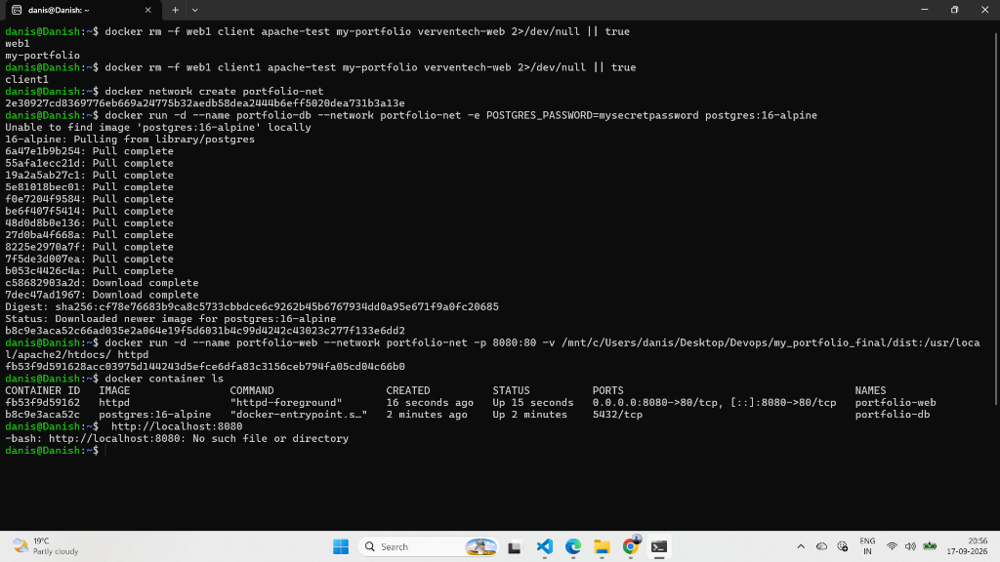
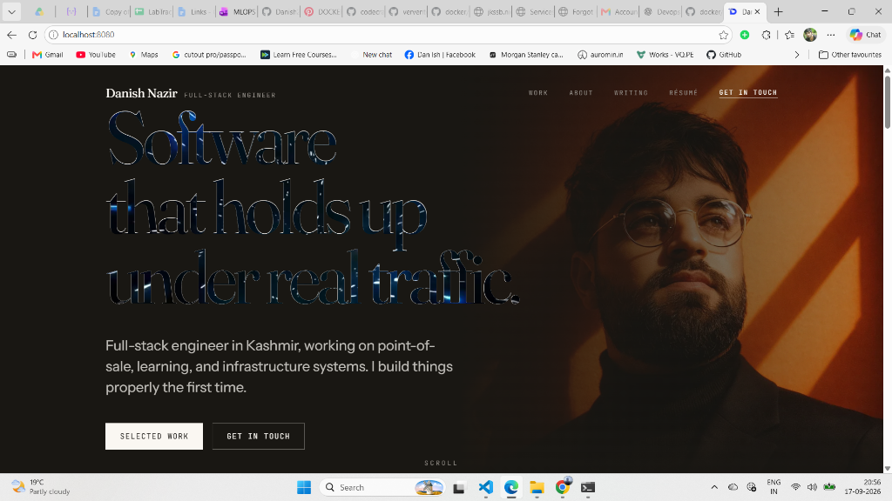

# Lab 57: Run Portfolio Project Using 2 Containers

## 📌 Objective

Deploy a multi-tier microservice architecture for the portfolio website using two interconnected Docker containers on an isolated user-defined Docker bridge network:
1. **Frontend Web Server Container** (`portfolio-web`): Apache serving compiled portfolio web assets with port forwarding `8080:80`.
2. **Backend Database Container** (`portfolio-db`): PostgreSQL 16 Alpine running on the private internal network.

---

## 🏗️ Architecture Diagram

```text
       Browser (Host Machine)
                 │
                 │ http://localhost:8080
                 ▼
     ┌───────────────────────┐
     │ Host Port: 8080       │
     └───────────┬───────────┘
                 │ (-p 8080:80)
                 ▼
┌─────────────────────────────────────────────────────────────┐
│               Custom Docker Network (portfolio-net)         │
│                                                             │
│   ┌──────────────────────────┐    Internal DNS    ┌──────────────────────┐
│   │   Frontend Container     │   "portfolio-db"   │   Backend Database   │
│   │   (portfolio-web)        ├───────────────────►│   (portfolio-db)     │
│   │   Apache (httpd)         │      Port 5432     │   PostgreSQL 16      │
│   │   Port 80                │                    │   Private Network    │
│   └────────────┬─────────────┘                    └──────────────────────┘
│                │
│                ▼
│    Mounted Production Build
│    from Desktop/Devops/.../dist
└─────────────────────────────────────────────────────────────┘
```

---

## ▶️ Hands-On Execution Steps

### 1. Clean Up Previous Containers

Remove existing test containers to ensure port 8080 and container names are free:

```bash
docker rm -f web1 client1 apache-test my-portfolio verventech-web 2>/dev/null || true
```

---

### 2. Create the Custom Bridge Network

Create an isolated network for inter-container communication with automatic DNS:

```bash
docker network create portfolio-net
```

---

### 3. Launch Container 1 — Database Tier (PostgreSQL)

Deploy PostgreSQL on `portfolio-net`:

```bash
docker run -d \
  --name portfolio-db \
  --network portfolio-net \
  -e POSTGRES_PASSWORD=mysecretpassword \
  postgres:16-alpine
```

* Notice: **No `-p` flag** is used! For security in production, databases should only be accessible internally within the Docker network, not exposed to the public internet.

---

### 4. Launch Container 2 — Frontend Tier (Apache + Portfolio)

Run the Apache web server, attach it to `portfolio-net`, forward port `8080`, and mount the local portfolio production build:

```bash
docker run -d \
  --name portfolio-web \
  --network portfolio-net \
  -p 8080:80 \
  -v /mnt/c/Users/danis/Desktop/Devops/my_portfolio_final/dist:/usr/local/apache2/htdocs/ \
  httpd
```

---

### 5. Verify Running Containers

```bash
docker container ls
```

**Output Observed:**
```text
CONTAINER ID   IMAGE                COMMAND                  CREATED          STATUS          PORTS                                   NAMES
fb53f9d59162   httpd                "httpd-foreground"       16 seconds ago   Up 15 seconds   0.0.0.0:8080->80/tcp, [::]:8080->80/tcp portfolio-web
b8c9e3aca52c   postgres:16-alpine   "docker-entrypoint.s…"   2 minutes ago    Up 2 minutes    5432/tcp                                portfolio-db
```

### 📸 Screenshot — Terminal Execution & Status



---

### 6. Verify in Browser

Navigate to **http://localhost:8080** in Google Chrome or any browser on Windows.

Result: The full portfolio website is live and served through the multi-container architecture!

### 📸 Screenshot — Portfolio Website Live in Browser



---

## 🧾 Commands Used in This Lab

| # | Command | Description |
|---|---------|-------------|
| 1 | `docker network create portfolio-net` | Create custom network for 2-tier architecture |
| 2 | `docker run -d --name portfolio-db --network portfolio-net -e POSTGRES_PASSWORD=... postgres:16-alpine` | Run backend database container |
| 3 | `docker run -d --name portfolio-web --network portfolio-net -p 8080:80 -v ... httpd` | Run frontend web container with port mapping and volume mount |
| 4 | `docker container ls` | Inspect and verify both containers running together |

---

## 📝 Key Takeaways

1. **Multi-Tier Separation**: Decoupling the frontend presentation container (`portfolio-web`) from the backend data store (`portfolio-db`) mirrors real-world production setups.
2. **Internal Network Security**: The database container is intentionally not exposed via `-p` to the host machine. Only containers inside `portfolio-net` can reach it on port 5432.
3. **Automatic Service Discovery**: If the frontend needs to connect to the database, it simply connects to `portfolio-db:5432` without worrying about IP changes.
