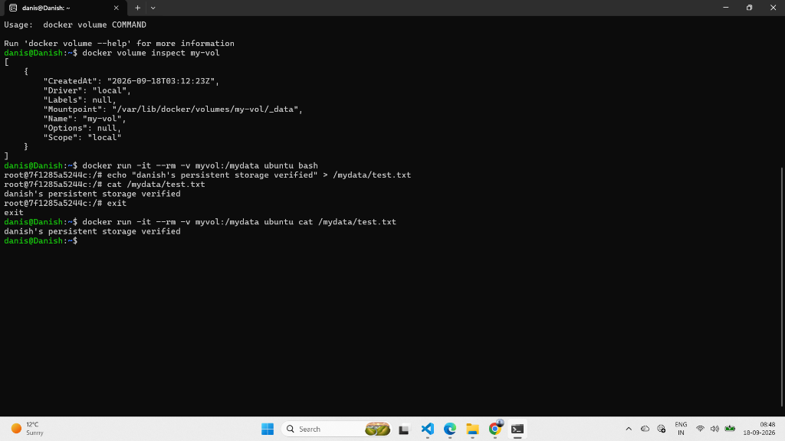
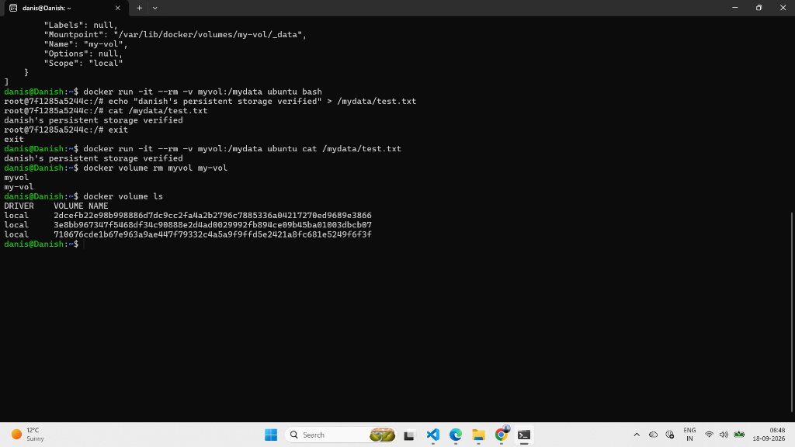

# Lab 58: Docker Storage Architecture & Management

## 📌 Objective

Understand the Docker storage architecture, differentiate between ephemeral container writable layers and persistent storage strategies, and master Docker volume lifecycle commands (`create`, `ls`, `inspect`, `rm`) with data persistence verification.

---

## 🧠 Docker Storage Architecture

By default, files written inside a container are stored in the temporary **writable container layer**. When a container is deleted (`docker rm`), its writable layer is destroyed and all data is lost.

Docker provides three persistent storage mechanisms:

```text
┌─────────────────────────────────────────────────────────────┐
│                         HOST SYSTEM                         │
├─────────────────────────────────────────────────────────────┤
│                                                             │
│   1. DOCKER NAMED VOLUMES                                   │
│      Stored in Docker's managed storage directory:          │
│      /var/lib/docker/volumes/<volume_name>/_data            │
│      (Managed completely by Docker CLI & Engine)            │
│                                                             │
│   2. BIND MOUNTS                                            │
│      Stored anywhere on the host filesystem:                │
│      C:\Users\danis\Desktop\...  or  /home/danis/...        │
│      (Directly accessible and modified by host user)        │
│                                                             │
│   3. TMPFS MOUNTS                                           │
│      Stored purely in host system RAM memory                │
│      (Never written to disk; lost when container stops)     │
│                                                             │
└──────────────────────────────┬──────────────────────────────┘
                               │ Mount point (-v)
                               ▼
┌─────────────────────────────────────────────────────────────┐
│                      CONTAINER LAYER                        │
│          Mounted to container directory (e.g. /mydata)      │
└─────────────────────────────────────────────────────────────┘
```

---

## 📊 Storage Types Comparison

| Feature | Named Volumes | Bind Mounts | tmpfs Mounts |
|---------|---------------|-------------|--------------|
| **Host Location** | Managed by Docker (`/var/lib/docker/volumes/`) | Arbitrary host path | Host RAM memory |
| **Portability** | High (identical across OS platforms) | Medium (depends on host path structure) | Linux only |
| **Persistence** | Survives container deletion | Survives container deletion | Discarded on container stop |
| **Best Used For** | Databases, production services | Local development, source code sync | Passwords, sensitive temp data |

---

## ▶️ Hands-On Execution Steps

### 1. List Existing Volumes

```bash
docker volume ls
```

---

### 2. Create a Named Volume

```bash
docker volume create my-vol
```

---

### 3. Inspect Volume Metadata

Examine the volume's physical storage path on the host system:

```bash
docker volume inspect my-vol
```

**Output Observed:**
```json
[
    {
        "CreatedAt": "2026-09-18T03:12:23Z",
        "Driver": "local",
        "Labels": null,
        "Mountpoint": "/var/lib/docker/volumes/my-vol/_data",
        "Name": "my-vol",
        "Options": null,
        "Scope": "local"
    }
]
```

> **Key Discovery:** The `"Mountpoint"` proves that Docker isolates and stores the volume data in `/var/lib/docker/volumes/my-vol/_data`.

---

### 4. Persistence Test (Part 1: Write to Volume & Destroy Container)

Run an ephemeral Ubuntu container (`--rm` means delete immediately upon exit), mount the volume to `/mydata`, write a test file, and exit:

```bash
docker run -it --rm -v myvol:/mydata ubuntu bash
```

Inside container:
```bash
echo "danish's persistent storage verified" > /mydata/test.txt
cat /mydata/test.txt
exit
```

---

### 5. Persistence Test (Part 2: Read from a Completely NEW Container)

Start a brand new container mounting the same volume to prove data survived container deletion:

```bash
docker run -it --rm -v myvol:/mydata ubuntu cat /mydata/test.txt
```

**Output Observed:**
```text
danish's persistent storage verified
```

✅ **Data persistence verified!** The file survived container destruction.

### 📸 Screenshot — Volume Inspection & Persistence Verification



---

### 6. Volume Cleanup

Delete the test volumes and verify:

```bash
docker volume rm myvol my-vol
docker volume ls
```

### 📸 Screenshot — Volume Deletion and Final Verification



---

## 🧾 Commands Reference Table

| # | Command | Purpose |
|---|---------|---------|
| 1 | `docker volume ls` | List all local Docker volumes |
| 2 | `docker volume create <name>` | Create a new named volume |
| 3 | `docker volume inspect <name>` | Display JSON configuration and host mountpoint |
| 4 | `docker run -v <vol>:<path>` | Mount a volume into a container directory |
| 5 | `docker volume rm <name>` | Delete a specific volume |
| 6 | `docker volume prune` | Clean up all dangling/unattached volumes |

---

## 📝 Key Takeaways

1. **Containers are Ephemeral**: Any data saved inside a container without a volume is permanently destroyed when the container is removed.
2. **Volumes are Independent**: Volumes have a separate lifecycle from containers. Deleting a container does not delete the volume.
3. **Multi-Container Sharing**: Multiple containers can mount the same volume simultaneously to read and write shared data.
4. **Physical Location**: Docker handles file permissions and directory mapping under `/var/lib/docker/volumes/`, keeping host and container storage clean and separated.

