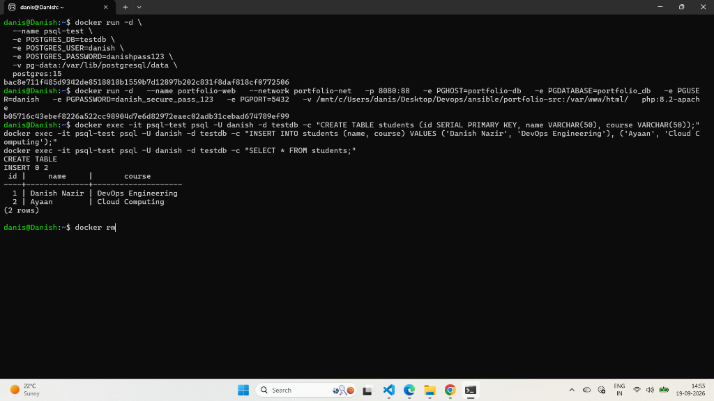
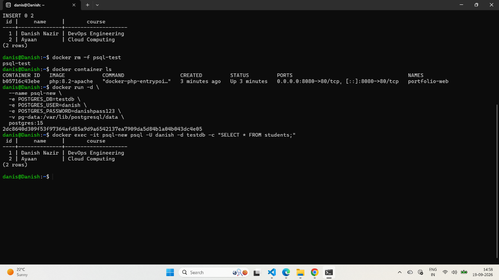

# Lab 59: Demo Docker Volume on PostgreSQL Container

## 📌 Objective

Demonstrate database data persistence using Docker **Named Volumes** with a PostgreSQL 15 container. Verify that database tables and records survive container destruction (`docker rm -f`) and remain immediately queryable by a brand-new container mounting the same volume.

---

## 🧠 Architecture & Persistence Flow

PostgreSQL writes its databases, tables, and write-ahead logs to `/var/lib/postgresql/data`. By binding this directory to a Docker named volume (`pg-data`), the data exists independently on the host disk.

```text
Step 1: Container 1 (psql-test)
        ├── Writes database: testdb
        ├── Creates table: students
        └── Inserts records: 'Danish Nazir', 'Ayaan'
                     │
                     ▼ (-v pg-data:/var/lib/postgresql/data)
        ┌─────────────────────────┐
        │ Docker Volume: pg-data  │  ◄── Data permanently stored on disk
        └─────────────────────────┘
                     ▲
                     │ (-v pg-data:/var/lib/postgresql/data)
Step 2: Container 1 is forcefully destroyed (docker rm -f psql-test) 💥

Step 3: Container 2 (psql-new) launches fresh!
        └── Queries: SELECT * FROM students;
        └── Result: Records intact without recreation! ✅
```

---

## ▶️ Step-by-Step Execution

### 1. Create Dedicated Named Volume

```bash
docker volume create pg-data
```

---

### 2. Launch Container 1 (`psql-test`) with Volume

```bash
docker run -d \
  --name psql-test \
  -e POSTGRES_DB=testdb \
  -e POSTGRES_USER=danish \
  -e POSTGRES_PASSWORD=danishpass123 \
  -v pg-data:/var/lib/postgresql/data \
  postgres:15
```

---

### 3. Create Table & Insert Data into Container 1

```bash
docker exec -it psql-test psql -U danish -d testdb -c "CREATE TABLE students (id SERIAL PRIMARY KEY, name VARCHAR(50), course VARCHAR(50));"
docker exec -it psql-test psql -U danish -d testdb -c "INSERT INTO students (name, course) VALUES ('Danish Nazir', 'DevOps Engineering'), ('Ayaan', 'Cloud Computing');"
docker exec -it psql-test psql -U danish -d testdb -c "SELECT * FROM students;"
```

**Output Observed:**
```text
CREATE TABLE
INSERT 0 2
 id |     name     |       course       
----+--------------+--------------------
  1 | Danish Nazir | DevOps Engineering
  2 | Ayaan        | Cloud Computing
(2 rows)
```

### 📸 Screenshot — Creating Table and Inserting Data



---

### 4. Destroy Container 1

Forcefully stop and delete `psql-test`:

```bash
docker rm -f psql-test
```

Verify it is completely gone:
```bash
docker container ls
```

---

### 5. Launch Container 2 (`psql-new`) Using the SAME Volume

Start a brand-new container attached to `pg-data`:

```bash
docker run -d \
  --name psql-new \
  -e POSTGRES_DB=testdb \
  -e POSTGRES_USER=danish \
  -e POSTGRES_PASSWORD=danishpass123 \
  -v pg-data:/var/lib/postgresql/data \
  postgres:15
```

---

### 6. Verify Data Recovery from Container 2

Query the database directly without running any `CREATE TABLE` or `INSERT` statements:

```bash
docker exec -it psql-new psql -U danish -d testdb -c "SELECT * FROM students;"
```

**Output Observed:**
```text
 id |     name     |       course       
----+--------------+--------------------
  1 | Danish Nazir | DevOps Engineering
  2 | Ayaan        | Cloud Computing
(2 rows)
```

✅ **Data persistence verified!** All tables and rows survived container destruction.

### 📸 Screenshot — Container Destroyed & Data Recovered in New Container



---

## 🧹 Cleanup Instructions

```bash
docker rm -f psql-new
docker volume rm pg-data
```

---

## 🧾 Commands Reference Table

| # | Command | Purpose |
|---|---------|---------|
| 1 | `docker volume create pg-data` | Create dedicated volume for database storage |
| 2 | `docker run -d --name ... -v pg-data:/var/lib/postgresql/data postgres:15` | Run PostgreSQL with persistent volume mount |
| 3 | `docker exec -it psql-test psql -U danish -d testdb -c "..."` | Execute SQL queries non-interactively |
| 4 | `docker rm -f psql-test` | Force destroy container to test data durability |
| 5 | `docker volume rm pg-data` | Permanently remove volume when cleaning up |

---

## 📝 Key Takeaways

1. **Database Durability**: Relational databases inside Docker must **always** use volumes; otherwise, container crashes or updates will result in total data loss.
2. **Instant Reattachment**: A new container mounting an existing database volume immediately mounts the existing cluster files without re-initializing the database.
3. **Decoupled Architecture**: Container lifecycle (stateless compute) is completely separated from Volume lifecycle (stateful storage).

