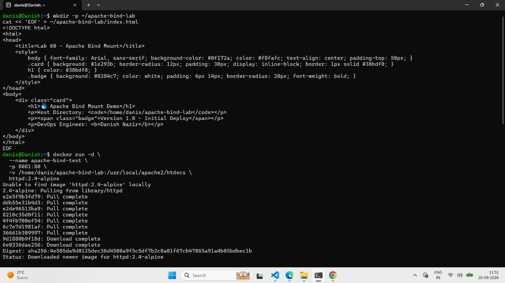
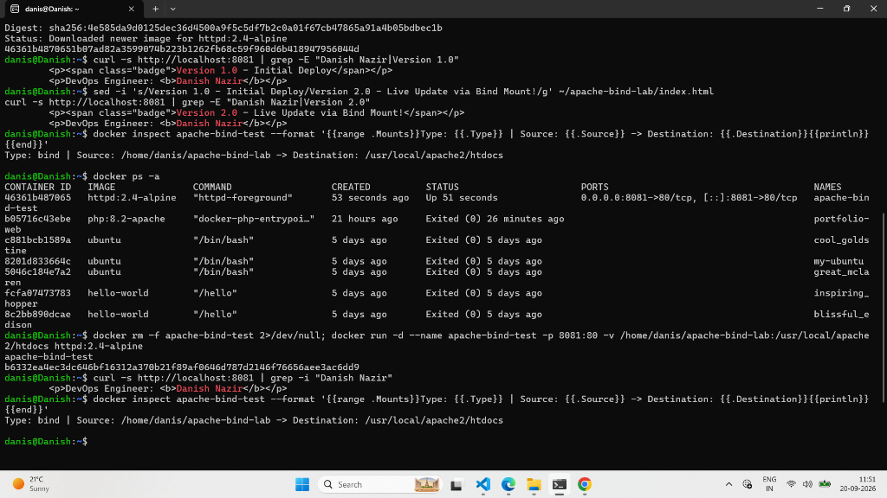
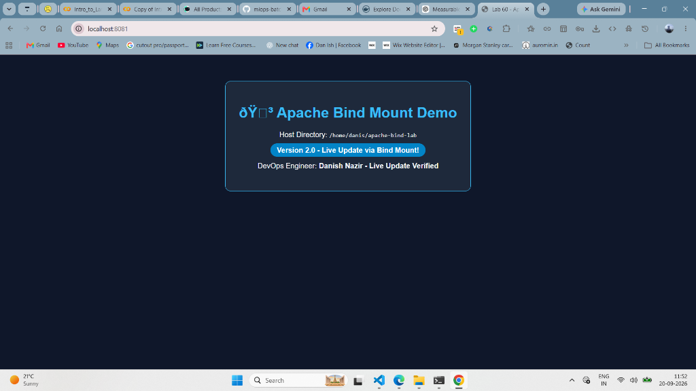

# 60 - Demo Bind Mount on Apache Container


---

## 📌 Lab Overview & Objectives

In modern DevOps and containerized application development, engineers need a way to rapidly iterate on code without rebuilding Docker images or restarting containers on every single code change.

In this lab, we demonstrate the power and mechanics of **Docker Bind Mounts** using an **Apache HTTP Server (`httpd:2.4-alpine`)** container:
1. Map an exact, dedicated host directory (`/home/danis/apache-bind-lab`) directly into Apache's DocumentRoot (`/usr/local/apache2/htdocs`).
2. Verify that Apache serves the host-resident HTML files instead of its internal container image defaults.
3. Perform a **zero-downtime hot-reload test**: modify the source HTML file on the host machine and prove that the running container immediately serves the updated content in real time.
4. Inspect the low-level container mount configuration using `docker inspect` to verify the mount type is explicitly registered as `"bind"`.

---

## 🏗️ Bind Mount Architecture

Unlike **Docker Volumes** (which are abstracted and managed by the Docker Engine inside `/var/lib/docker/volumes/`), a **Bind Mount** creates a direct pointer between a specific directory on the host filesystem and a path inside the container namespace:

```text
Host System (WSL Ubuntu)                     Apache Container (httpd:2.4-alpine)
┌──────────────────────────────────────┐     ┌──────────────────────────────────────┐
│ /home/danis/apache-bind-lab/         │     │ /usr/local/apache2/htdocs/           │
│  └── index.html                      │ === │  └── index.html                      │
│      (Developer edits code directly) │     │      (Apache serves files live)      │
└──────────────────────────────────────┘     └──────────────────────────────────────┘
                   ▲                                            │
                   │                                            ▼
      (Direct Disk Pointer via -v)                     Port 8081:80 (NAT)
                                                                │
                                                                ▼
                                                      http://localhost:8081
```

---

## 🛠️ Step-by-Step Hands-on Execution

### Step 1: Create Host Workspace and Initial Web Page

We create a dedicated project directory on our host machine and generate our initial `index.html`:

```bash
mkdir -p ~/apache-bind-lab
cat << 'EOF' > ~/apache-bind-lab/index.html
<!DOCTYPE html>
<html>
<head>
    <title>Lab 60 - Apache Bind Mount</title>
    <style>
        body { font-family: Arial, sans-serif; background-color: #0f172a; color: #f8fafc; text-align: center; padding-top: 50px; }
        .card { background: #1e293b; border-radius: 12px; padding: 30px; display: inline-block; border: 1px solid #38bdf8; }
        h1 { color: #38bdf8; }
        .badge { background: #0284c7; color: white; padding: 6px 14px; border-radius: 20px; font-weight: bold; }
    </style>
</head>
<body>
    <div class="card">
        <h1>🐳 Apache Bind Mount Demo</h1>
        <p>Host Directory: <code>/home/danis/apache-bind-lab</code></p>
        <p><span class="badge">Version 1.0 - Initial Deploy</span></p>
        <p>DevOps Engineer: <b>Danish Nazir</b></p>
    </div>
</body>
</html>
EOF
```

---

### Step 2: Run Apache Container with the Bind Mount

We start the Apache container in detached mode (`-d`), exposing port `8081` on the host to port `80` in the container, and mount our host directory:

```bash
docker run -d \
  --name apache-bind-test \
  -p 8081:80 \
  -v /home/danis/apache-bind-lab:/usr/local/apache2/htdocs \
  httpd:2.4-alpine
```

**Terminal Verification:**
```text
Unable to find image 'httpd:2.4-alpine' locally
2.4-alpine: Pulling from library/httpd
e2e5f9b3fd79: Pull complete
ddb55e31b4d3: Pull complete
e2de96513ba9: Pull complete
8210c35d0f11: Pull complete
4f4fb700ef54: Pull complete
6c7e7d1981af: Pull complete
36661b309997: Pull complete
9d1880b9f18d: Download complete
6e0336dae256: Download complete
Digest: sha256:4e585da9d0125dec36d4500a9f5c5df7b2c0a01f67cb47865a91a4b05bdbec1b
Status: Downloaded newer image for httpd:2.4-alpine
46361b4870651b07ad82a3599074b223b1262fb68c59f960d6b418947956044d
```



---

### Step 3: Validate Initial Web Deployment

Using `curl`, we send an HTTP request to `http://localhost:8081` to verify Apache is serving our host file:

```bash
curl -s http://localhost:8081 | grep -E "Danish Nazir|Version 1.0"
```

**Output:**
```html
        <p><span class="badge">Version 1.0 - Initial Deploy</span></p>
        <p>DevOps Engineer: <b>Danish Nazir</b></p>
```

---

### Step 4: Real-Time Live Hot-Reload Test (Host Modification)

To test the core advantage of bind mounts, we update the HTML file on the host machine using `sed` without restarting or modifying the container:

```bash
sed -i 's/Version 1.0 - Initial Deploy/Version 2.0 - Live Update via Bind Mount!/g' ~/apache-bind-lab/index.html
sed -i 's/Danish Nazir/Danish Nazir - Live Update Verified/g' ~/apache-bind-lab/index.html
```

We immediately query `http://localhost:8081`:

```bash
curl -s http://localhost:8081 | grep -E "Danish Nazir|Version 2.0"
```

**Output:**
```html
        <p><span class="badge">Version 2.0 - Live Update via Bind Mount!</span></p>
        <p>DevOps Engineer: <b>Danish Nazir - Live Update Verified</b></p>
```

> **Zero Downtime:** The web server served the new version instantaneously without stopping, restarting, or executing commands inside the container.

---

### Step 5: Verify Mount Metadata via Docker Inspect

We verify that Docker has registered this filesystem linkage as a **bind mount**:

```bash
docker inspect apache-bind-test --format '{{range .Mounts}}Type: {{.Type}} | Source: {{.Source}} -> Destination: {{.Destination}}{{println}}{{end}}'
```

**Output:**
```text
Type: bind | Source: /home/danis/apache-bind-lab -> Destination: /usr/local/apache2/htdocs
```



---

### Step 6: Browser UI Verification

We open Google Chrome / Microsoft Edge and navigate to `http://localhost:8081`:



The live web page renders cleanly with:
- Title: **Apache Bind Mount Demo**
- Host Directory: `/home/danis/apache-bind-lab`
- Active Badge: **Version 2.0 - Live Update via Bind Mount!**
- Verified Engineer: **Danish Nazir - Live Update Verified**

---

## 📊 Summary: Bind Mount vs. Named Volume

| Criteria | Bind Mount (`-v /path:/path`) | Named Volume (`-v name:/path`) |
| :--- | :--- | :--- |
| **Host Path Location** | User-defined anywhere on host (`~/apache-bind-lab`) | Docker-managed (`/var/lib/docker/volumes/`) |
| **Host File Editing** | Direct & immediate via host tools (VS Code, nano, sed) | Hidden from host direct edits; managed via Docker CLI |
| **Portability** | Relies on host directory structure existing | High portability across different host environments |
| **Primary DevOps Use** | **Live development, hot-reloading code & web assets** | **Databases (PostgreSQL, MySQL), production state** |

---

## 👤 Lab Verification & Author

- **DevOps Engineer:** Danish Nazir
- **Track:** MLOps & DevOps Engineering (VerveTech)
- **Container Name:** `apache-bind-test`
- **Host Port:** `8081` (Container Port `80`)
- **Verification Status:** ✅ Passed (Initial serve, live hot-reload, and inspect validated)
