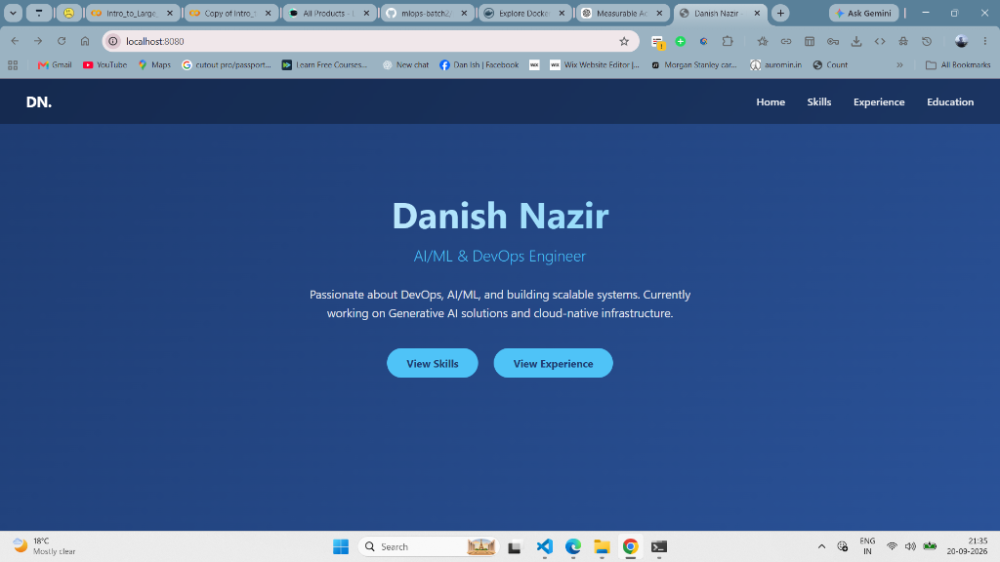

# 61 - Run Portfolio Website Using Volume & Bind Mounts Containers


---

## 📌 Lab Overview & Objectives

In production DevOps environments, a single storage mechanism is rarely used in isolation. Instead, modern microservice and multi-tier architectures combine **Docker Named Volumes** and **Bind Mounts** to address distinct application requirements:

- **Stateful Database Tier (PostgreSQL):** Requires high-performance, managed, crash-safe data persistence that survives container termination. This is solved with a **Docker Named Volume**.
- **Stateless Web Application Tier (PHP + Apache):** Requires immediate hot-reloading of source code without rebuilding images during active development. This is solved with a **Host Bind Mount**.

In this capstone storage lab, we engineer and deploy the complete dynamic **LAPP Stack (Linux, Apache, PostgreSQL, PHP) DevOps Portfolio** combining:
1. A custom bridge network (`portfolio-net`) with automated Docker DNS resolution.
2. A PostgreSQL database container (`portfolio-db`) backed by a persistent Named Volume (`portfolio-pgdata`).
3. Database schema population using `init.sql`.
4. A PHP-Apache web container (`portfolio-web`) backed by a host Bind Mount (`portfolio-src:/var/www/html`).
5. Live browser verification on port `8080` displaying dynamic skills, experience, and education records.

---

## 🏗️ Multi-Tier Architecture & Storage Topologies

```text
                                [ Docker Network: portfolio-net ]
                                                │
         ┌──────────────────────────────────────┴──────────────────────────────────────┐
         ▼                                                                             ▼
┌──────────────────────────────────────┐                      ┌──────────────────────────────────────┐
│  Container: portfolio-web            │                      │  Container: portfolio-db             │
│  Image: php:8.2-apache               │                      │  Image: postgres:15                  │
│  Port Forwarding: 0.0.0.0:8080->80   │                      │  Internal Port: 5432                 │
│  DB Host: "portfolio-db"             │                      │  Database: portfolio_db              │
└──────────────────┬───────────────────┘                      └──────────────────┬───────────────────┘
                   │                                                             │
        [ BIND MOUNT (-v) ]                                           [ DOCKER VOLUME (-v) ]
                   │                                                             │
                   ▼                                                             ▼
┌──────────────────────────────────────┐                      ┌──────────────────────────────────────┐
│ Host Filesystem Path:                │                      │ Docker Managed Storage Engine:       │
│ /mnt/c/.../portfolio-src             │                      │ portfolio-pgdata                     │
│ Target: /var/www/html                │                      │ Target: /var/lib/postgresql/data     │
│ (Live Code Editing on Host)          │                      │ (Persistent Relational Tables)       │
└──────────────────────────────────────┘                      └──────────────────────────────────────┘
                   │
                   ▼
         http://localhost:8080
```

---

## 🛠️ Step-by-Step Hands-on Execution

### Step 1: Initialize Custom Network and Named Volume

We create an isolated bridge network and allocate persistent volume storage:

```bash
docker network create portfolio-net 2>/dev/null || true
docker volume create portfolio-pgdata
```

---

### Step 2: Deploy PostgreSQL Container with Named Volume

We run the PostgreSQL database container attached to `portfolio-net`, mounting our named volume to `/var/lib/postgresql/data`:

```bash
docker rm -f portfolio-db 2>/dev/null

docker run -d \
  --name portfolio-db \
  --network portfolio-net \
  -e POSTGRES_DB=portfolio_db \
  -e POSTGRES_USER=danish \
  -e POSTGRES_PASSWORD=danish_secure_pass_123 \
  -v portfolio-pgdata:/var/lib/postgresql/data \
  postgres:15
```

---

### Step 3: Populate Database Schema (`init.sql`)

Once PostgreSQL initializes, we inject the schema to create `skills`, `projects`, and `education` tables and insert sample records:

```bash
sleep 5
docker exec -i portfolio-db psql -U danish -d portfolio_db < /mnt/c/Users/danis/Desktop/Devops/ansible/portfolio-src/init.sql
```

**Terminal Output:**
```text
CREATE TABLE
CREATE TABLE
CREATE TABLE
INSERT 0 10
INSERT 0 3
INSERT 0 1
```

---

### Step 4: Deploy PHP-Apache Container with Bind Mount

We start the web application container on port `8080`, attaching it to `portfolio-net` and bind mounting our local source directory directly into DocumentRoot:

```bash
docker rm -f portfolio-web 2>/dev/null

docker run -d \
  --name portfolio-web \
  --network portfolio-net \
  -p 8080:80 \
  -e PGHOST=portfolio-db \
  -e PGDATABASE=portfolio_db \
  -e PGUSER=danish \
  -e PGPASSWORD=danish_secure_pass_123 \
  -e PGPORT=5432 \
  -v /mnt/c/Users/danis/Desktop/Devops/ansible/portfolio-src:/var/www/html \
  php:8.2-apache
```

---

### Step 5: Install PostgreSQL Extension in PHP Container

Standard Debian-based PHP Apache images do not include PostgreSQL drivers by default. We compile and activate `pgsql` and `pdo_pgsql`:

```bash
docker exec -i portfolio-web bash -c "apt-get update -qq && apt-get install -y -qq libpq-dev >/dev/null && docker-php-ext-install -j\$(nproc) pgsql pdo_pgsql >/dev/null"
docker restart portfolio-web
```

---

### Step 6: Verify Dual Storage Configurations via Docker Inspect

We verify that both containers are utilizing their intended storage drivers:

#### 1. Database Volume Verification:
```bash
docker inspect portfolio-db --format '{{range .Mounts}}Mount Type: {{.Type}} | Name: {{.Name}} | Destination: {{.Destination}}{{println}}{{end}}'
```
**Output:**
```text
Mount Type: volume | Name: portfolio-pgdata | Destination: /var/lib/postgresql/data
```

#### 2. Web App Bind Mount Verification:
```bash
docker inspect portfolio-web --format '{{range .Mounts}}Mount Type: {{.Type}} | Source: {{.Source}} | Destination: {{.Destination}}{{println}}{{end}}'
```
**Output:**
```text
Mount Type: bind | Source: /mnt/c/Users/danis/Desktop/Devops/ansible/portfolio-src | Destination: /var/www/html
```

---

### Step 7: Live Web UI Browser Verification

We open Google Chrome / Microsoft Edge and navigate to **`http://localhost:8080`**:



The application renders dynamically:
- **Title:** Danish Nazir — AI/ML & DevOps Engineer
- **Navigation:** Home, Skills, Experience, Education
- **Database Connectivity:** Successfully queries records from `portfolio_db` running inside `portfolio-db` across `portfolio-net`.
- **Live Code Sync:** Any edits made to files inside `portfolio-src` on Windows are reflected immediately in the browser via the Bind Mount.

---

## 📊 Comparison Matrix: Production Storage Patterns

| Tier | Component | Storage Mechanism | Implementation Flag | Rationale |
| :--- | :--- | :--- | :--- | :--- |
| **Database** | PostgreSQL 15 | **Named Volume** | `-v portfolio-pgdata:/var/lib/postgresql/data` | Container-independent data persistence, native Linux I/O performance, decoupled lifecycle. |
| **Web Server** | PHP 8.2 Apache | **Bind Mount** | `-v /mnt/c/.../portfolio-src:/var/www/html` | Direct host file access, zero-build hot-reloading for frontend/backend scripts. |
| **Networking** | Inter-Tier DNS | **User Bridge** | `--network portfolio-net` | Automatic DNS resolution using container names (`PGHOST=portfolio-db`). |

---

## 👤 Lab Verification & Author

- **DevOps Engineer:** Danish Nazir
- **Track:** MLOps & DevOps Engineering (VerveTech)
- **Web Endpoint:** `http://localhost:8080`
- **Database Host:** `portfolio-db:5432`
- **Verification Status:** ✅ Complete (Dual storage, networking, database schema, and web rendering verified)
