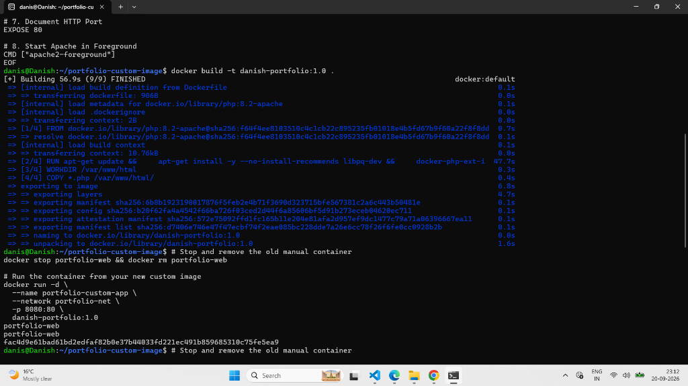
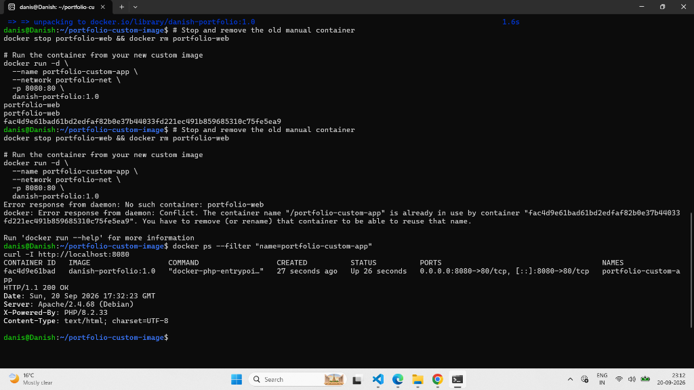
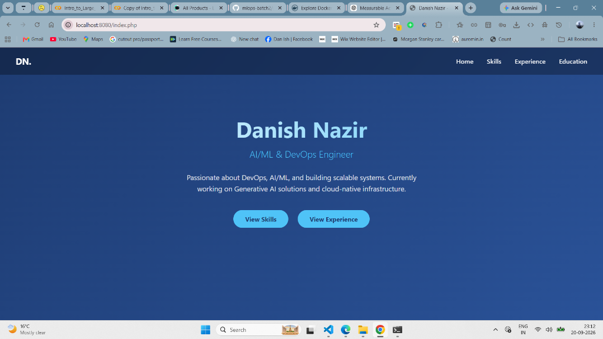

# Lab 63: Run Portfolio Using Custom Portfolio Image

## 📌 Lab Overview & Real-World DevOps Context

In previous labs (**Lab 57** and **Lab 61**), we deployed a multi-container LAPP stack by combining PostgreSQL and an official `php:8.2-apache` image from Docker Hub. However, that approach had critical production drawbacks:
1. **Missing Drivers**: The official PHP Docker image lacks PostgreSQL extensions (`pgsql` and `pdo_pgsql`). In previous labs, we had to manually attach to the container via `docker exec -it` and run `apt-get` commands inside a running container.
2. **Configuration Drift**: If the container crashed, died, or scaled to 10 instances across a Kubernetes cluster, every new container would be missing the PostgreSQL driver and crash with:
   ```text
   Fatal error: Uncaught Error: Call to undefined function pg_connect()
   ```
3. **Host Dependency**: The application code relied on bind mounts from the host's local filesystem (`/mnt/c/.../portfolio-src`), meaning the container could not run independently on other servers or cloud environments.

### The DevOps Solution
In **Lab 63**, we solved all these problems by creating a **custom, self-contained, immutable Docker image** (`danish-portfolio:1.0`). We used a `Dockerfile` to bake:
- The base Apache + PHP 8.2 runtime
- The compiled PostgreSQL client drivers (`libpq-dev`, `pgsql`, `pdo_pgsql`)
- Production environment variables (`PGHOST`, `PGPORT`, `PGDATABASE`, `PGUSER`, `PGPASSWORD`)
- Danish's complete portfolio source code (`index.php`, `skills.php`, `projects.php`, `education.php`)

Now, Danish's portfolio can be deployed anywhere on Earth with a single `docker run` command—with **zero manual configuration**!

---

## 🏗️ Architecture & Multi-Container Flow

```
                      [ User / Browser ]
                              │
                    Port 8080 : 80
                              ▼
┌───────────────────────────────────────────────────────────┐
│  Container: portfolio-custom-app                          │
│  Image: danish-portfolio:1.0                              │
│                                                           │
│  ┌─────────────────────────────────────────────────────┐  │
│  │ Apache 2.4 + PHP 8.2 Runtime                        │  │
│  │ - Compiled Extensions: pgsql, pdo_pgsql             │  │
│  │ - Embedded Code: index.php, skills.php, etc.        │  │
│  │ - Baked ENV: PGHOST=portfolio-db, PGUSER=danish...  │  │
│  └─────────────────────────────────────────────────────┘  │
└─────────────────────────────┬─────────────────────────────┘
                              │
                   Internal DNS Resolution
                 (portfolio-net: port 5432)
                              │
                              ▼
┌───────────────────────────────────────────────────────────┐
│  Container: portfolio-db                                  │
│  Image: postgres:15                                       │
│                                                           │
│  ┌─────────────────────────────────────────────────────┐  │
│  │ Database: portfolio_db                              │  │
│  │ Tables: skills (10), projects (3), education (1)    │  │
│  │ User: danish (Owner)                                │  │
│  └─────────────────────────────────────────────────────┘  │
│  Volume Mount: portfolio-pgdata -> /var/lib/postgresql/data│
└───────────────────────────────────────────────────────────┘
```

---

## 📝 Step-by-Step Implementation

### Step 1: Set Up Build Directory & Gather Source Files

We created an isolated build directory in WSL and copied all required PHP pages into the context:

```bash
mkdir -p ~/portfolio-custom-image && cd ~/portfolio-custom-image
cp /mnt/c/Users/danis/Desktop/Devops/ansible/portfolio-src/*.php .
ls -la
```

**Verification Output:**
```text
total 24
drwxr-xr-x 2 danis danis 4096 Sep 20 17:30 .
drwxr-x--- 17 danis danis 4096 Sep 20 17:30 ..
-rwxr-xr-x 1 danis danis 2279 Sep 20 17:30 education.php
-rwxr-xr-x 1 danis danis 3275 Sep 20 17:30 index.php
-rwxr-xr-x 1 danis danis 2262 Sep 20 17:30 projects.php
-rwxr-xr-x 1 danis danis 2778 Sep 20 17:30 skills.php
```

---

### Step 2: Write the Production `Dockerfile`

We wrote a multi-step `Dockerfile` to produce our custom image:

```dockerfile
# 1. Base Image with Apache & PHP 8.2
FROM php:8.2-apache

# 2. Maintainer & Metadata
LABEL maintainer="Danish Nazir <danishnazir20699@gmail.com>"
LABEL role="DevOps Engineer & Full-Stack Developer"

# 3. Bake PostgreSQL dependencies and PHP extensions into immutable layer
RUN apt-get update && \
    apt-get install -y --no-install-recommends libpq-dev && \
    docker-php-ext-install pgsql pdo_pgsql && \
    apt-get clean && \
    rm -rf /var/lib/apt/lists/*

# 4. Default Database Environment Variables
ENV PGHOST=portfolio-db \
    PGDATABASE=portfolio_db \
    PGUSER=danish \
    PGPASSWORD=danish_secure_pass_123 \
    PGPORT=5432

# 5. Set Working Directory
WORKDIR /var/www/html

# 6. Copy Portfolio Application Source Code into Image
COPY *.php /var/www/html/

# 7. Document HTTP Port
EXPOSE 80

# 8. Start Apache in Foreground
CMD ["apache2-foreground"]
```

---

### Step 3: Build Custom Image (`danish-portfolio:1.0`)

We built the image using the Docker CLI:

```bash
docker build -t danish-portfolio:1.0 .
```

**Terminal Verification Output:**
```text
[+] Building 56.9s (9/9) FINISHED
 => [internal] load build definition from Dockerfile
 => => transferring dockerfile: 906B
 => [1/4] FROM docker.io/library/php:8.2-apache
 => [2/4] RUN apt-get update && apt-get install -y libpq-dev && docker-php-ext-install pgsql pdo_pgsql
 => [3/4] WORKDIR /var/www/html
 => [4/4] COPY *.php /var/www/html/
 => exporting to image
 => naming to docker.io/library/danish-portfolio:1.0
```



---

### Step 4: Stop Old Container & Deploy Custom Container

We removed the legacy manual container and deployed a new container from our custom image on the custom bridge network (`portfolio-net`):

```bash
# Remove old container
docker stop portfolio-web && docker rm portfolio-web

# Run container from custom image
docker run -d \
  --name portfolio-custom-app \
  --network portfolio-net \
  -p 8080:80 \
  danish-portfolio:1.0
```

---

### Step 5: Verification & Inspection

#### 1. Container Status & Port Mapping
```bash
docker ps --filter "name=portfolio-custom-app"
```
```text
CONTAINER ID   IMAGE                  COMMAND                  CREATED         STATUS         PORTS                                     NAMES
fac4d9e61bad   danish-portfolio:1.0   "docker-php-entrypoi…"   27 seconds ago  Up 26 seconds  0.0.0.0:8080->80/tcp, [::]:8080->80/tcp   portfolio-custom-app
```

#### 2. HTTP Header Response
```bash
curl -I http://localhost:8080
```
```text
HTTP/1.1 200 OK
Date: Sun, 20 Sep 2026 17:32:23 GMT
Server: Apache/2.4.68 (Debian)
X-Powered-By: PHP/8.2.33
Content-Type: text/html; charset=UTF-8
```



#### 3. Live Browser Verification
Navigating to `http://localhost:8080/index.php` verified that the custom container serves Danish's dynamic portfolio without requiring manual intervention, bind mounts, or runtime package installation:



---

## 💡 Key Takeaways & DevOps Best Practices

| Concept | Manual Container (Labs 57 & 61) | Custom Image (Lab 63) |
| :--- | :--- | :--- |
| **Driver Installation** | Run `apt-get` manually inside container | Pre-compiled into image layers via `RUN` |
| **Code Shipping** | Mounted from host via Bind Mount (`-v`) | Packaged directly inside image via `COPY` |
| **Reproducibility** | Poor (ephemeral, lost on container restart) | 100% Immutable and portable anywhere |
| **Startup Speed** | Slow (requires post-launch configuration) | Instantaneous (`docker run` starts in < 1s) |
| **Cloud/K8s Ready** | No (tied to host local paths) | Yes (can be pushed to Docker Hub / AWS ECR) |
